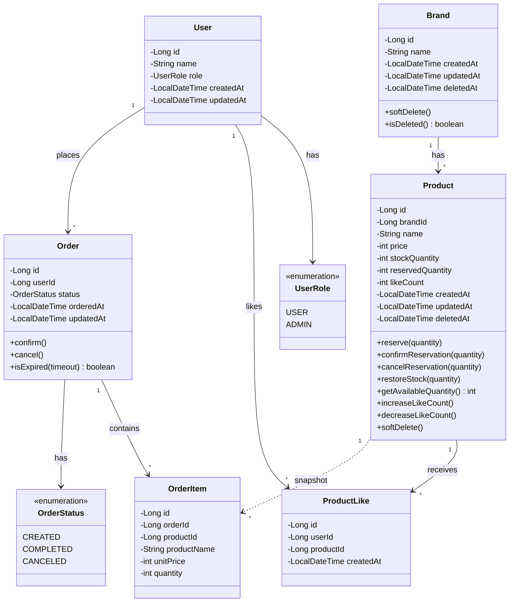

# 클래스 다이어그램

각 도메인의 책임 범위와 의존 방향을 확인하기 위한 다이어그램이다. Order가 Product를 직접 참조하지 않고 스냅샷(OrderItem)으로 분리한 것이 핵심 설계 결정이다.

**해석**:
- `User`는 `UserRole`로 일반 사용자와 관리자를 구분한다. 좋아요와 주문의 주체이다.
- `Product → OrderItem`이 점선(`..>`)인 것은 직접 참조가 아닌 스냅샷 관계를 의미한다. OrderItem은 주문 시점의 상품명, 단가를 자체 보관한다.
- Product가 `likeCount`를 직접 관리한다. 이 비정규화 필드는 비동기 이벤트(Kafka)로 갱신된다.
- Product에 `reservedQuantity` 필드가 있다. 주문 가능 수량 = `stockQuantity - reservedQuantity`이다.
- 재고 관련 메서드가 예약 흐름을 반영한다: `reserve`(예약) → `confirmReservation`(확정: 예약 재고 감소 + 실제 재고 차감) / `cancelReservation`(취소: 예약 재고 감소). `restoreStock`은 COMPLETED 주문 취소 시 실제 재고 복원용이다.
- Brand, Product에 `deletedAt`이 있으며, 소프트 삭제를 지원한다.
- Order의 `isExpired(timeout)`은 타임아웃 배치에서 사용한다.
