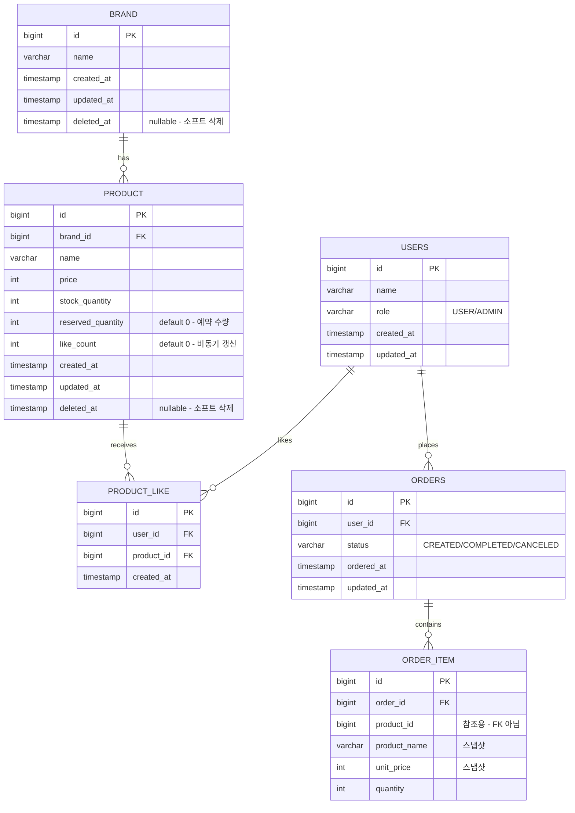

# ERD

실제 테이블 구조와 관계, 제약 조건을 정의한다. 소프트 삭제, 좋아요 유니크 제약, 주문 상품 스냅샷 구조를 검증하기 위해 작성한다.

**해석**:
- 테이블명을 `USERS`로 한 것은 `USER`가 SQL 예약어이기 때문이다. `ORDERS`도 동일한 이유이다.
- `USERS.role`로 일반 사용자와 관리자를 구분한다.
- `BRAND`, `PRODUCT`에 `deleted_at` 컬럼이 있다. 일반 사용자 조회에서는 `WHERE deleted_at IS NULL` 조건이 필요하다.
- `PRODUCT_LIKE`에 `(user_id, product_id)` **유니크 인덱스**가 필요하다. "이미 좋아요한 상품" 예외 처리의 DB 레벨 보장이다.
- `ORDER_ITEM.product_id`는 FK가 아닌 참조용 컬럼이다. 소프트 삭제된 상품도 주문 이력에서 추적 가능하다.
- `PRODUCT.reserved_quantity`는 주문 예약 시 원자적 조건부 UPDATE(`WHERE stock_quantity - reserved_quantity >= ?`)로 갱신된다. `SELECT FOR UPDATE` 없이 락 시간을 최소화한다.
- `ORDERS.status`에 인덱스가 필요하다. 타임아웃 배치에서 CREATED 상태를 조회할 때 사용된다.

## 인덱스 전략

| 테이블 | 인덱스 | 용도 |
|--------|--------|------|
| PRODUCT_LIKE | UNIQUE (user_id, product_id) | 중복 좋아요 방지 |
| PRODUCT | (brand_id, deleted_at) | 브랜드별 상품 조회 + 소프트 삭제 필터 |
| PRODUCT | (deleted_at, like_count) | 인기순 정렬 조회 |
| PRODUCT | (deleted_at, created_at) | 최신순 정렬 조회 |
| PRODUCT | (deleted_at, price) | 가격순 정렬 조회 |
| ORDERS | (user_id, status) | 사용자별 주문 목록 조회 |
| ORDERS | (status, ordered_at) | 타임아웃 배치 조회 |
| ORDER_ITEM | (order_id) | 주문별 상품 목록 조회 |
