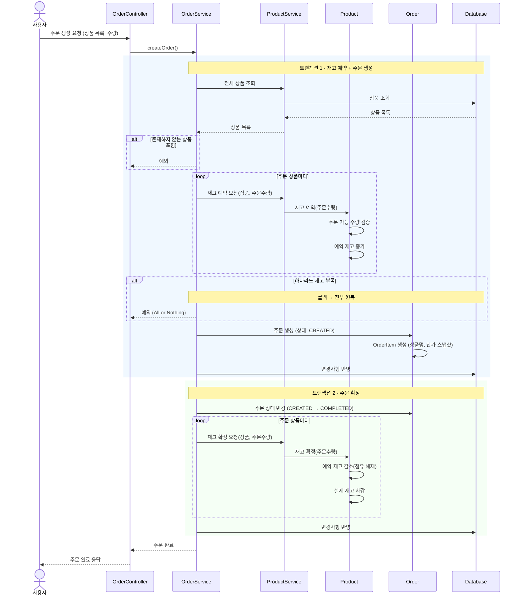
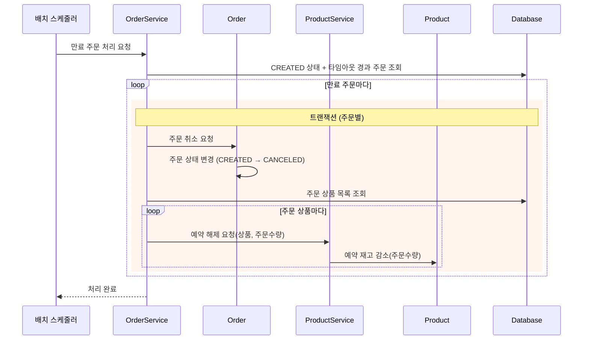
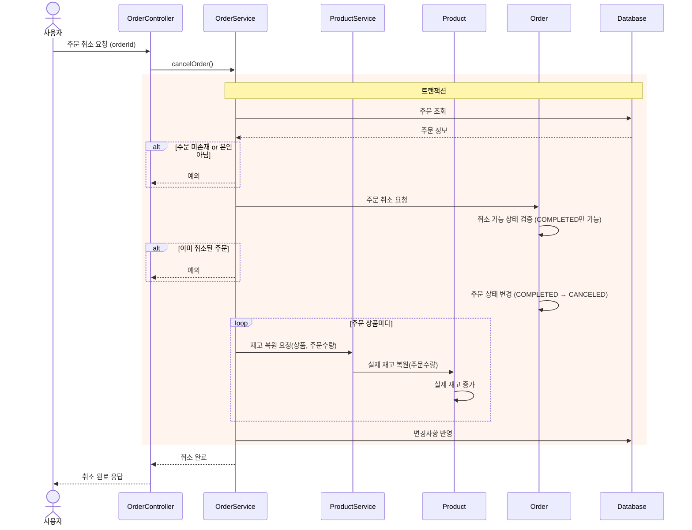

# 시퀀스 다이어그램

## 주문 생성

주문 생성은 재고 예약(트랜잭션 1)과 주문 확정(트랜잭션 2)으로 분리된다. 트랜잭션 1에서 예약 재고를 점유하고 주문을 CREATED 상태로 생성한 뒤, 트랜잭션 2에서 예약 재고를 실제 재고로 확정하고 주문을 COMPLETED로 변경한다.

**해석**:
- 트랜잭션 1에서 예약 재고를 점유하고 주문을 CREATED로 생성한다. 실패 시 전부 롤백된다.
- 트랜잭션 2에서 예약 재고를 해제하고 실제 재고를 차감하며, 주문을 COMPLETED로 확정한다.
- `Product`가 주문 가능 수량 검증과 재고 예약/확정을 담당한다. 재고 관련 비즈니스 로직이 도메인 객체에 있다.
- `Order` 생성 시 `OrderItem`에 상품 스냅샷(상품명, 단가)을 보관한다. 이후 상품 정보가 변경되어도 주문 이력은 유지된다.
- 트랜잭션을 분리함으로써 향후 결제 연동, 비동기 처리 등의 확장이 가능하다.

---

## 주문 타임아웃 배치

주문 생성은 두 개의 트랜잭션으로 분리되어 있다. 추후 결제 프로세스가 추가될 경우, 트랜잭션 1과 2 사이에 결제가 위치하게 된다. 결제는 외부 PG사 호출로 응답 시간이 길어질 수 있으므로, 하나의 트랜잭션으로 묶으면 DB 커넥션을 오래 점유하게 된다. 이를 방지하기 위해 트랜잭션을 분리한다.
- **트랜잭션 1**: 예약 재고 점유 + 주문 생성(CREATED)
- **트랜잭션 2**: 예약 재고 해제 + 실제 재고 차감 + 주문 확정(COMPLETED)

주문 생성(트랜잭션 1)이 커밋된 후 주문 확정 및 실재고 차감(트랜잭션 2)이 실패하면(DB 커넥션 유실, 애플리케이션 크래시 등), CREATED 상태의 주문과 예약 재고가 점유된 채로 남는다. 이를 정리하지 않으면 해당 수량만큼 주문 가능 재고가 영구적으로 줄어든다. 타임아웃 배치는 이 상황을 주기적으로 감지하여 예약 재고를 원복하고 주문을 취소한다.

**해석**:
- 주문별로 트랜잭션을 분리하여, 하나의 주문 취소 실패가 다른 주문에 영향을 주지 않도록 한다.
- 타임아웃 배치에서는 예약 재고만 감소시킨다. 실제 재고는 아직 차감 전이므로 변경 불필요하다.
- 타임아웃 시간은 설정값으로 외부화한다.

---

## 주문 취소

주문 취소 시 실제 재고를 복원한다. COMPLETED 상태의 주문은 이미 예약 재고 → 실제 재고 확정이 끝났으므로, 실제 재고만 증가시킨다.

