# 시퀀스 다이어그램

## 목차

- [브랜드](#브랜드)
  - [브랜드 목록 조회 (사용자)](#브랜드-목록-조회-사용자)
  - [브랜드 상세 조회 (사용자)](#브랜드-상세-조회-사용자)
  - [브랜드 등록 (관리자)](#브랜드-등록-관리자)
  - [브랜드 목록 조회 (관리자)](#브랜드-목록-조회-관리자)
  - [브랜드 상세 조회 (관리자)](#브랜드-상세-조회-관리자)
  - [브랜드 수정 (관리자)](#브랜드-수정-관리자)
  - [브랜드 삭제 (관리자)](#브랜드-삭제-관리자)
- [상품](#상품)
  - [상품 목록 조회 (사용자)](#상품-목록-조회-사용자)
  - [상품 상세 조회 (사용자)](#상품-상세-조회-사용자)
  - [상품 등록 (관리자)](#상품-등록-관리자)
  - [상품 목록 조회 (관리자)](#상품-목록-조회-관리자)
  - [상품 상세 조회 (관리자)](#상품-상세-조회-관리자)
  - [상품 수정 (관리자)](#상품-수정-관리자)
  - [상품 삭제 (관리자)](#상품-삭제-관리자)
- [좋아요](#좋아요)
  - [좋아요 등록](#좋아요-등록)
  - [좋아요 취소](#좋아요-취소)
  - [좋아요한 상품 목록 조회](#좋아요한-상품-목록-조회)
- [주문](#주문)
  - [주문 생성](#주문-생성)
  - [주문 취소](#주문-취소)
  - [주문 목록 조회 (사용자)](#주문-목록-조회-사용자)
  - [주문 상세 조회 (사용자)](#주문-상세-조회-사용자)
  - [주문 목록 조회 (관리자)](#주문-목록-조회-관리자)
  - [주문 상세 조회 (관리자)](#주문-상세-조회-관리자)

---

## 공통: 인증 정책

모든 API 요청에는 아래 인증 정책이 적용된다. 개별 시퀀스 다이어그램에서는 인증 흐름을 생략한다.

| 대상 | 인증 방식 | 실패 응답 |
|------|-----------|-----------|
| 사용자 | X-Loopers-LoginId / X-Loopers-LoginPw 헤더 검증 | 401 Unauthorized |
| 관리자 | X-Loopers-Ldap: loopers.admin 헤더 검증 | 403 Forbidden |

---

## 브랜드

### 브랜드 목록 조회 (사용자)

사용자는 브랜드 목록을 조회할 수 있다.

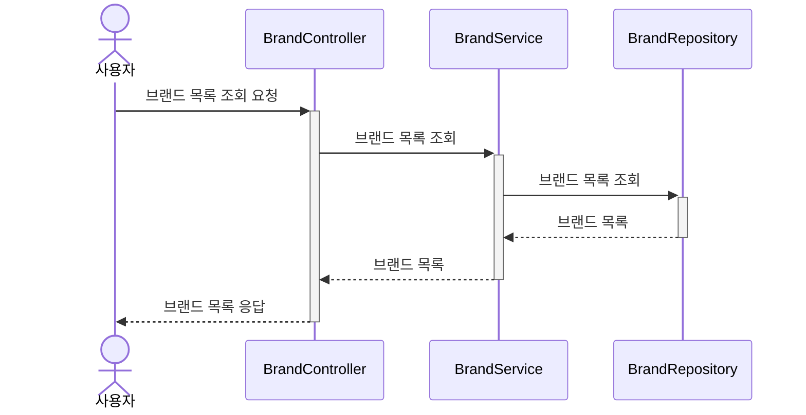


---

### 브랜드 상세 조회 (사용자)

사용자는 특정 브랜드의 상세 정보를 조회할 수 있다.

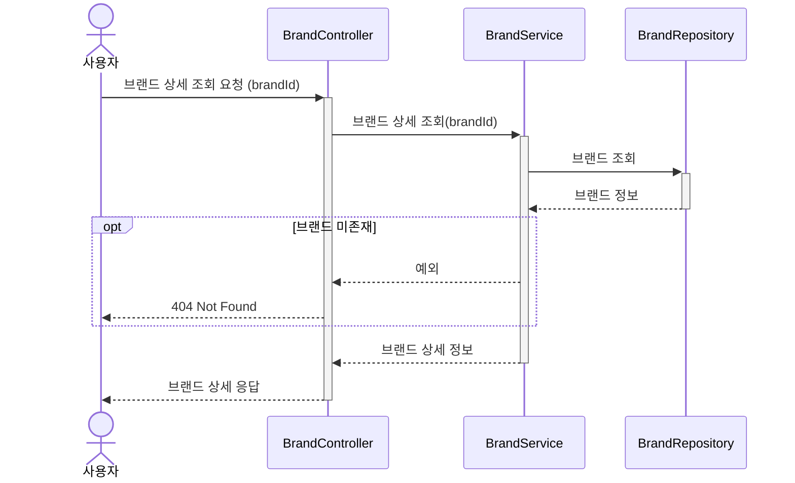

---

### 브랜드 등록 (관리자)

관리자는 새로운 브랜드를 등록할 수 있다.

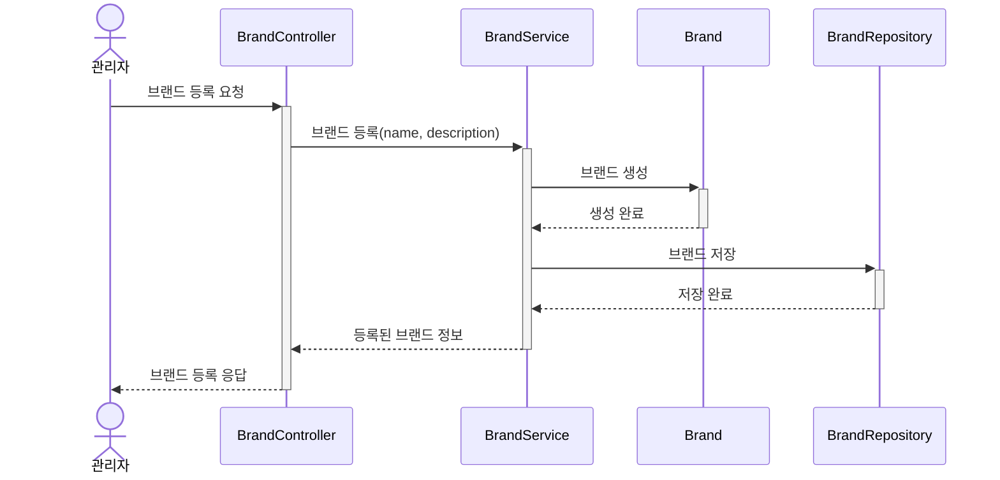

---

### 브랜드 목록 조회 (관리자)

관리자는 등록된 브랜드 목록을 조회할 수 있다.

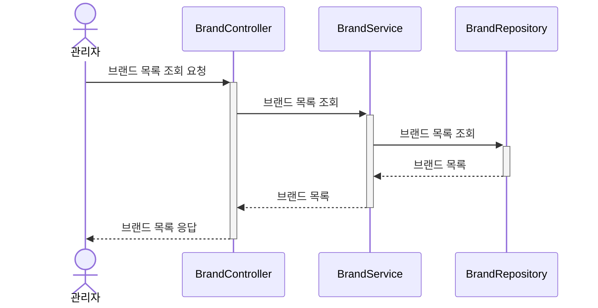

---

### 브랜드 상세 조회 (관리자)

관리자는 특정 브랜드의 상세 정보를 조회할 수 있다.


---

### 브랜드 수정 (관리자)

관리자는 브랜드 정보를 수정할 수 있다.

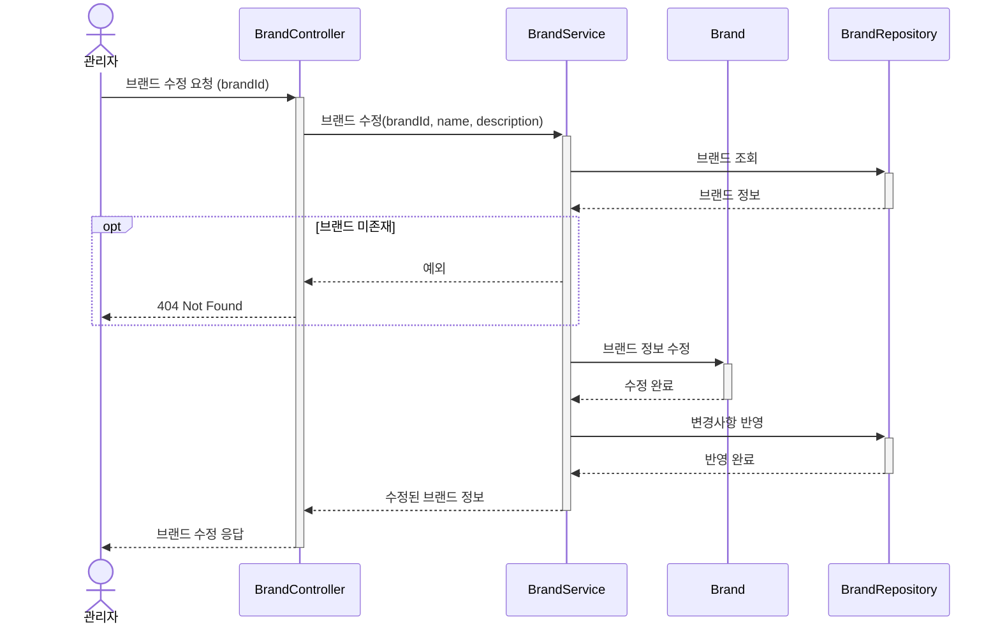

---

### 브랜드 삭제 (관리자)

관리자는 브랜드를 삭제할 수 있다. 브랜드 삭제 시 해당 브랜드에 속한 상품의 좋아요와 상품도 함께 삭제된다.

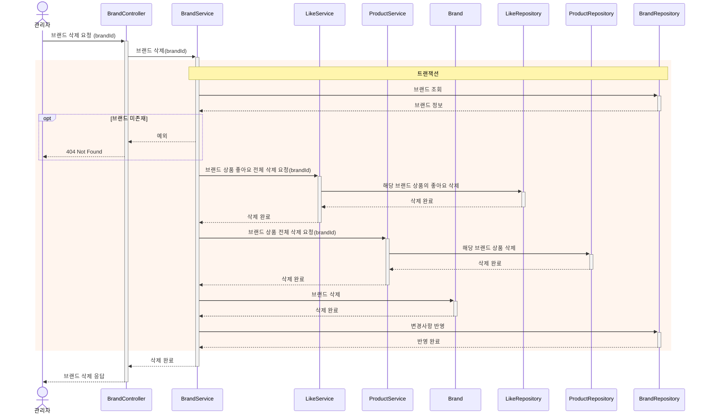

**해석**:
- 브랜드 삭제는 좋아요(하드 삭제) → 상품(소프트 삭제) → 브랜드(소프트 삭제) 순서로 캐스케이드 삭제된다.
- 하나의 트랜잭션 안에서 처리되어 일관성을 보장한다.

---

## 상품

### 상품 목록 조회 (사용자)

사용자는 상품 목록을 조회할 수 있다.

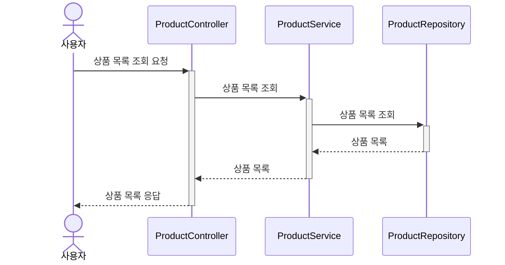


---

### 상품 상세 조회 (사용자)

사용자는 특정 상품의 상세 정보를 조회할 수 있다.


---

### 상품 등록 (관리자)

관리자는 새로운 상품을 등록할 수 있다. 상품이 속할 브랜드가 사전에 등록되어 있어야 한다.

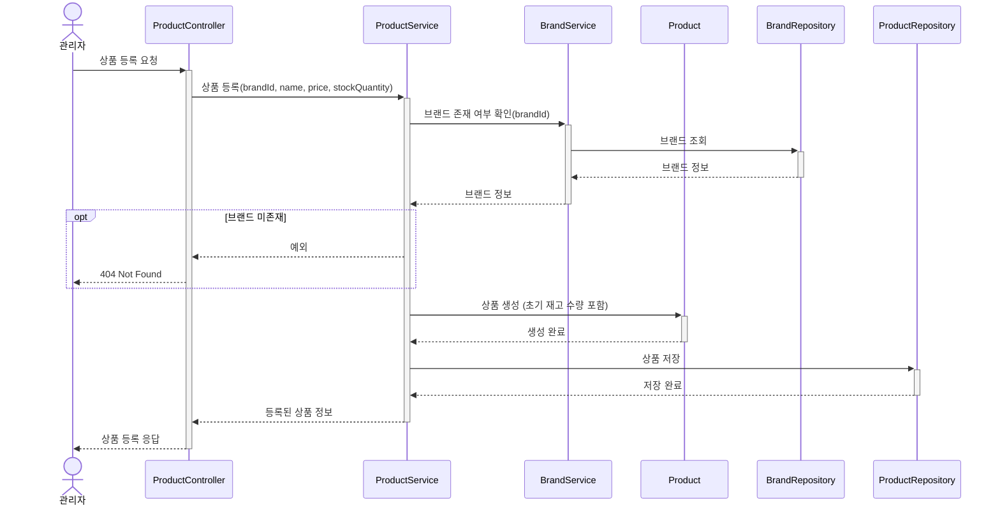

---

### 상품 목록 조회 (관리자)

관리자는 등록된 상품 목록을 조회할 수 있다.


---

### 상품 상세 조회 (관리자)

관리자는 특정 상품의 상세 정보를 조회할 수 있다.

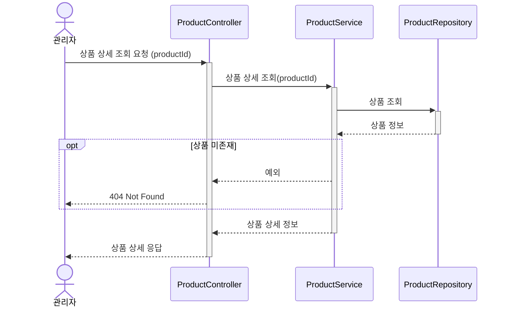

---

### 상품 수정 (관리자)

관리자는 상품 정보를 수정할 수 있다. 재고 수량도 수정 가능하다.

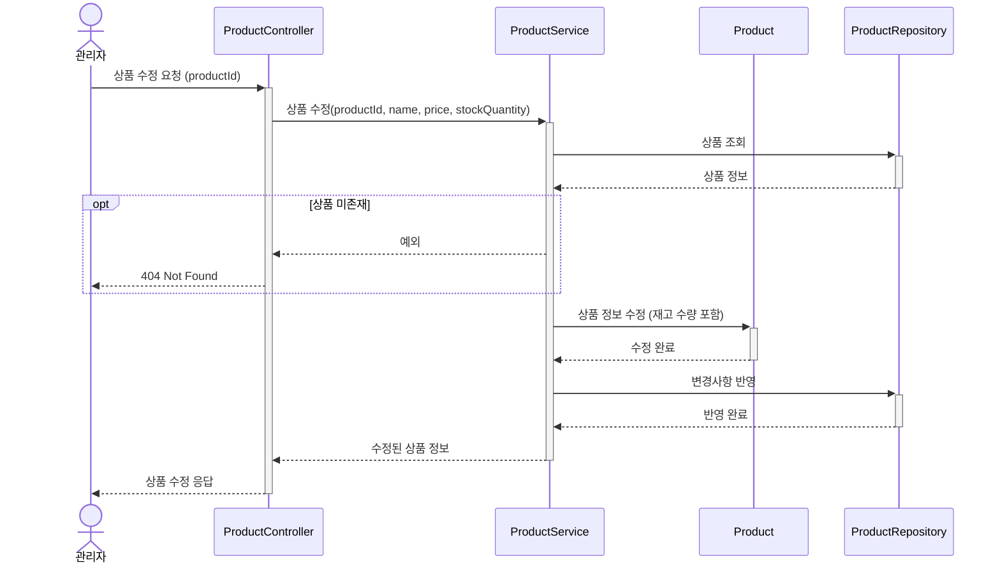

---

### 상품 삭제 (관리자)

관리자는 상품을 삭제할 수 있다. 상품 삭제 시 해당 상품의 좋아요도 함께 삭제된다.

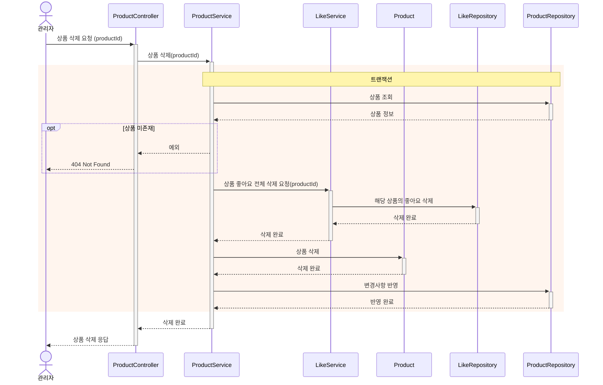

**해석**:
- 상품 삭제는 좋아요(하드 삭제) → 상품(소프트 삭제) 순서로 캐스케이드 삭제된다.
- 하나의 트랜잭션 안에서 처리되어 일관성을 보장한다.

---

## 좋아요

### 좋아요 등록

사용자는 특정 상품에 좋아요를 할 수 있다.

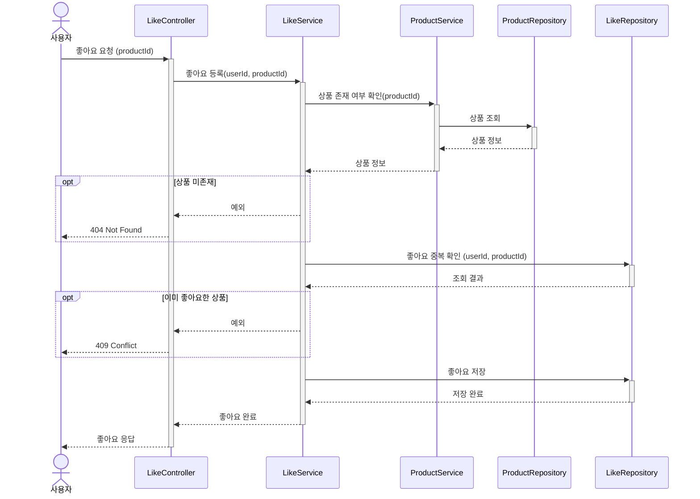

**해석**:
- 동일 상품에 대한 중복 좋아요는 허용되지 않는다.
- 좋아요 수는 별도 필드에 저장하지 않고, 조회 시 `product_likes` 테이블에서 COUNT 집계로 계산한다.

---

### 좋아요 취소

사용자는 자신이 좋아요한 상품의 좋아요를 취소할 수 있다.

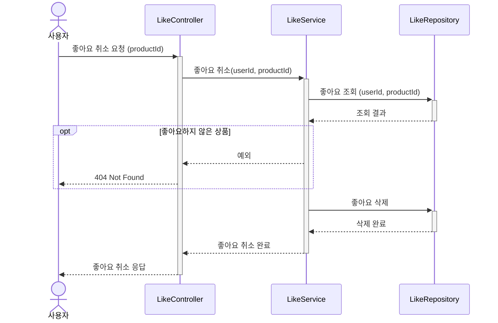

**해석**:
- 좋아요하지 않은 상품에 대한 취소 요청은 예외 처리된다.
- 좋아요 삭제는 하드 삭제(DELETE)로 처리된다.

---

### 좋아요한 상품 목록 조회

사용자는 자신이 좋아요한 상품 목록을 조회할 수 있다.

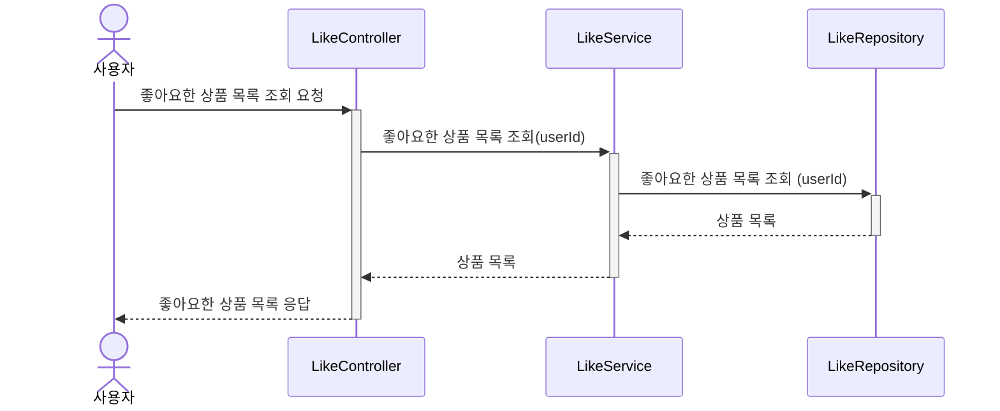

---

## 주문

### 주문 생성

사용자는 여러 상품을 한 번에 주문할 수 있다. 단일 트랜잭션에서 재고 검증, 재고 차감, 주문 생성을 처리한다.

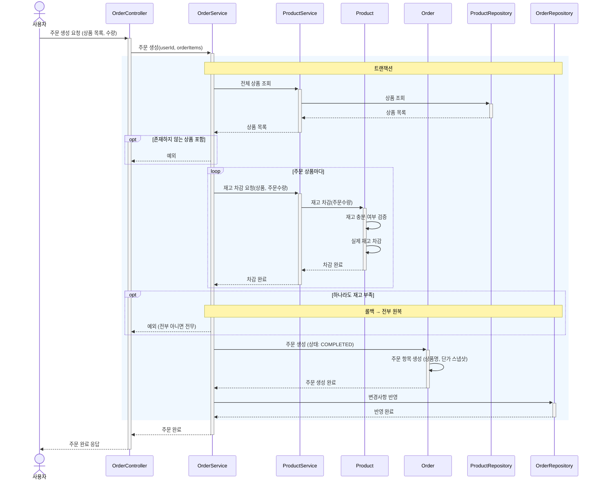

**해석**:
- 단일 트랜잭션에서 재고 검증 → 재고 차감 → 주문 생성(COMPLETED)을 처리한다. 실패 시 전부 롤백된다.
- `Product`가 재고 충분 여부 검증과 재고 차감을 담당한다. 재고 관련 비즈니스 로직이 도메인 객체에 있다.
- `Order` 생성 시 `OrderItem`에 상품 스냅샷(상품명, 단가)을 보관한다. 이후 상품 정보가 변경되어도 주문 이력은 유지된다.

---

### 주문 취소

주문 취소 시 실제 재고를 복원한다.

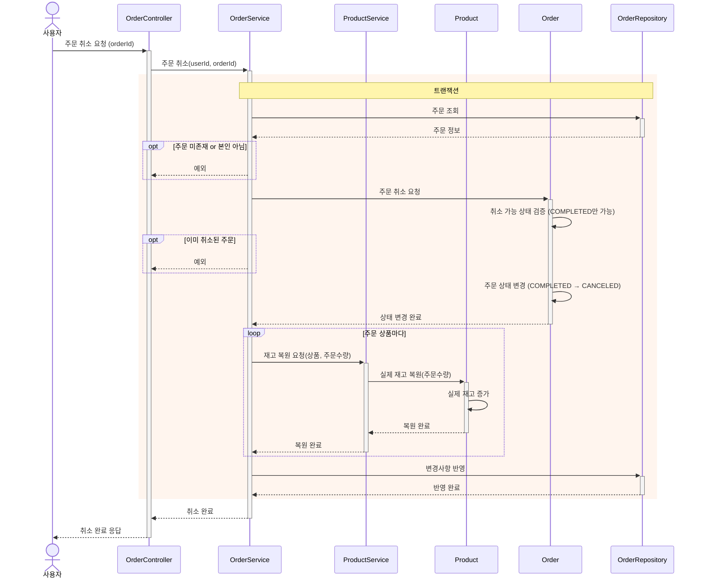

---

### 주문 목록 조회 (사용자)

사용자는 본인의 주문 내역을 조회할 수 있다.

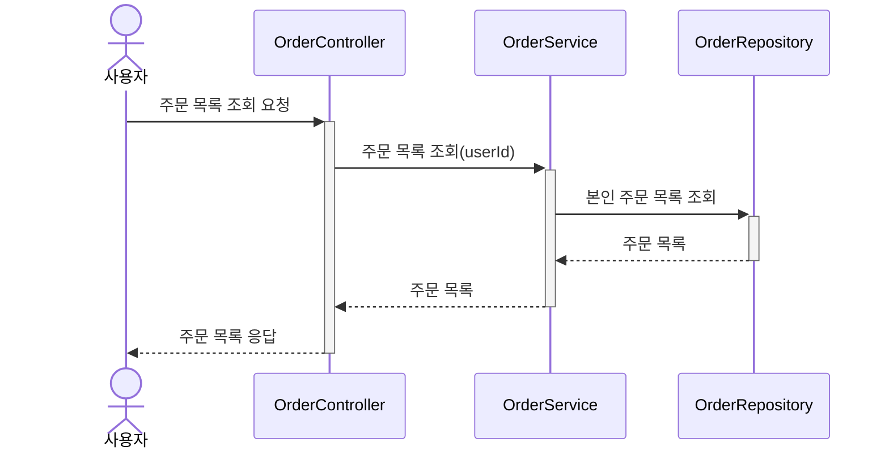

**해석**:
- 본인의 주문만 조회 가능하다.

---

### 주문 상세 조회 (사용자)

사용자는 본인의 특정 주문 상세 정보를 조회할 수 있다.

```mermaid
sequenceDiagram
    actor User as 사용자
    participant OC as OrderController
    participant OS as OrderService
    participant OR as OrderRepository

    User->>+OC: 주문 상세 조회 요청 (orderId)
    OC->>+OS: 주문 상세 조회(userId, orderId)
    OS->>+OR: 주문 조회 (주문 항목 포함)
    OR-->>-OS: 주문 정보

    opt 주문 미존재
        OS-->>OC: 예외
        OC-->>User: 404 Not Found
    end

    opt 본인 주문 아님
        OS-->>OC: 예외
        OC-->>User: 403 Forbidden
    end

    OS-->>-OC: 주문 상세 정보 (주문 상품 스냅샷 포함)
    OC-->>-User: 주문 상세 응답
```

**해석**:
- 본인의 주문만 조회 가능하다. 타 사용자의 주문 접근 시 예외 처리된다.
- 주문 상세에는 OrderItem의 스냅샷(상품명, 단가)이 포함된다.

---

### 주문 목록 조회 (관리자)

관리자는 전체 사용자의 주문 목록을 조회할 수 있다.

```mermaid
sequenceDiagram
    actor Admin as 관리자
    participant OC as OrderController
    participant OS as OrderService
    participant OR as OrderRepository

    Admin->>+OC: 주문 목록 조회 요청
    OC->>+OS: 전체 주문 목록 조회
    OS->>+OR: 전체 주문 목록 조회
    OR-->>-OS: 주문 목록
    OS-->>-OC: 주문 목록
    OC-->>-Admin: 주문 목록 응답
```

---

### 주문 상세 조회 (관리자)

관리자는 특정 주문의 상세 정보를 조회할 수 있다.

```mermaid
sequenceDiagram
    actor Admin as 관리자
    participant OC as OrderController
    participant OS as OrderService
    participant OR as OrderRepository

    Admin->>+OC: 주문 상세 조회 요청 (orderId)
    OC->>+OS: 주문 상세 조회(orderId)
    OS->>+OR: 주문 조회 (주문 항목 포함)
    OR-->>-OS: 주문 정보

    opt 주문 미존재
        OS-->>OC: 예외
        OC-->>Admin: 404 Not Found
    end

    OS-->>-OC: 주문 상세 정보 (주문 상품 스냅샷 포함)
    OC-->>-Admin: 주문 상세 응답
```
