# 시퀀스 다이어그램

## 목차

- [브랜드](#브랜드)
  - [브랜드 목록 조회 (사용자)](#브랜드-목록-조회-사용자)
  - [브랜드 상세 조회 (사용자)](#브랜드-상세-조회-사용자)
  - [브랜드 등록 (관리자)](#브랜드-등록-관리자)
  - [브랜드 목록 조회 (관리자)](#브랜드-목록-조회-관리자)
  - [브랜드 상세 조회 (관리자)](#브랜드-상세-조회-관리자)
  - [브랜드 수정 (관리자)](#브랜드-수정-관리자)
  - [브랜드 삭제 (관리자)](#브랜드-삭제-관리자)
- [상품](#상품)
  - [상품 목록 조회 (사용자)](#상품-목록-조회-사용자)
  - [상품 상세 조회 (사용자)](#상품-상세-조회-사용자)
  - [상품 등록 (관리자)](#상품-등록-관리자)
  - [상품 목록 조회 (관리자)](#상품-목록-조회-관리자)
  - [상품 상세 조회 (관리자)](#상품-상세-조회-관리자)
  - [상품 수정 (관리자)](#상품-수정-관리자)
  - [상품 삭제 (관리자)](#상품-삭제-관리자)
- [좋아요](#좋아요)
  - [좋아요 등록](#좋아요-등록)
  - [좋아요 취소](#좋아요-취소)
  - [좋아요한 상품 목록 조회](#좋아요한-상품-목록-조회)
- [주문](#주문)
  - [주문 생성](#주문-생성)
  - [주문 취소](#주문-취소)
  - [주문 목록 조회 (사용자)](#주문-목록-조회-사용자)
  - [주문 상세 조회 (사용자)](#주문-상세-조회-사용자)
  - [주문 목록 조회 (관리자)](#주문-목록-조회-관리자)
  - [주문 상세 조회 (관리자)](#주문-상세-조회-관리자)
- [쿠폰](#쿠폰)
  - [쿠폰 발급 요청](#쿠폰-발급-요청)
  - [내 쿠폰 목록 조회](#내-쿠폰-목록-조회)
  - [쿠폰 생성 (관리자)](#쿠폰-생성-관리자)
  - [쿠폰 목록 조회 (관리자)](#쿠폰-목록-조회-관리자)
  - [쿠폰 상세 조회 (관리자)](#쿠폰-상세-조회-관리자)
  - [쿠폰 수정 (관리자)](#쿠폰-수정-관리자)
  - [쿠폰 삭제 (관리자)](#쿠폰-삭제-관리자)
  - [쿠폰 발급 내역 조회 (관리자)](#쿠폰-발급-내역-조회-관리자)
- [결제](#결제)
  - [결제 요청 (정상)](#결제-요청-정상)
  - [결제 요청 (실패)](#결제-요청-실패)
  - [PG 콜백 수신](#pg-콜백-수신)

---

## 공통: 인증 정책

모든 API 요청에는 아래 인증 정책이 적용된다. 개별 시퀀스 다이어그램에서는 인증 흐름을 생략한다.

| 대상 | 인증 방식 | 실패 응답 |
|------|-----------|-----------|
| 사용자 | X-Loopers-LoginId / X-Loopers-LoginPw 헤더 검증 | 401 Unauthorized |
| 관리자 | X-Loopers-Ldap: loopers.admin 헤더 검증 | 403 Forbidden |

---

## 브랜드

### 브랜드 목록 조회 (사용자)

사용자는 브랜드 목록을 조회할 수 있다.

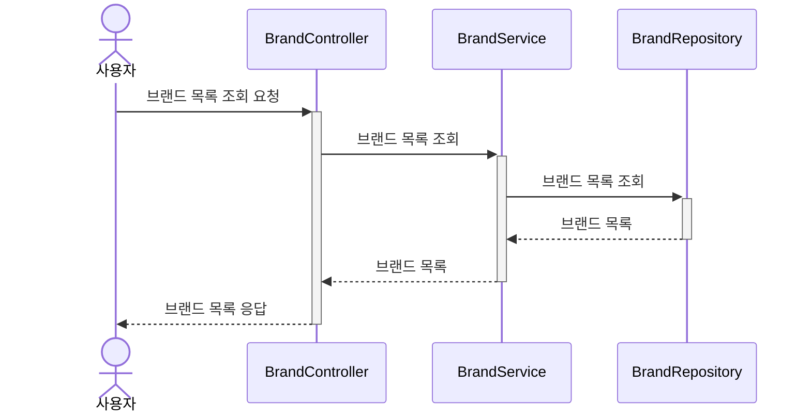
```mermaid
sequenceDiagram
    actor User as 사용자
    participant BC as BrandController
    participant BS as BrandService
    participant BR as BrandRepository

    User->>+BC: 브랜드 목록 조회 요청
    BC->>+BS: 브랜드 목록 조회
    BS->>+BR: 브랜드 목록 조회
    BR-->>-BS: 브랜드 목록
    BS-->>-BC: 브랜드 목록
    BC-->>-User: 브랜드 목록 응답
```

---

### 브랜드 상세 조회 (사용자)

사용자는 특정 브랜드의 상세 정보를 조회할 수 있다.

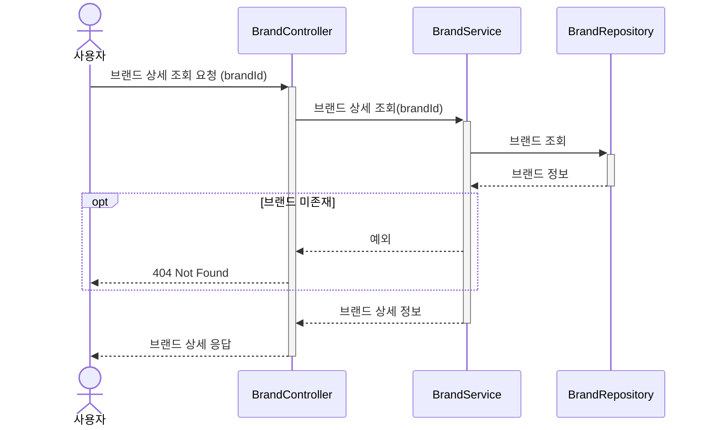
```mermaid
sequenceDiagram
    actor User as 사용자
    participant BC as BrandController
    participant BS as BrandService
    participant BR as BrandRepository

    User->>+BC: 브랜드 상세 조회 요청 (brandId)
    BC->>+BS: 브랜드 상세 조회(brandId)
    BS->>+BR: 브랜드 조회
    BR-->>-BS: 브랜드 정보

    opt 브랜드 미존재
        BS-->>BC: 예외
        BC-->>User: 404 Not Found
    end

    BS-->>-BC: 브랜드 상세 정보
    BC-->>-User: 브랜드 상세 응답
```

---

### 브랜드 등록 (관리자)

관리자는 새로운 브랜드를 등록할 수 있다.

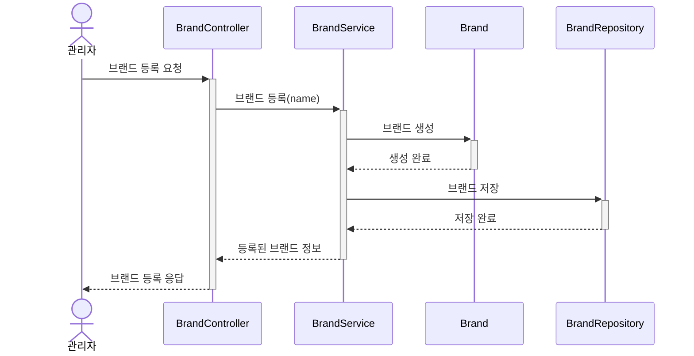
```mermaid
sequenceDiagram
    actor Admin as 관리자
    participant BC as BrandController
    participant BS as BrandService
    participant B as Brand
    participant BR as BrandRepository

    Admin->>+BC: 브랜드 등록 요청
    BC->>+BS: 브랜드 등록(name)
    BS->>+B: 브랜드 생성
    B-->>-BS: 생성 완료
    BS->>+BR: 브랜드 저장
    BR-->>-BS: 저장 완료
    BS-->>-BC: 등록된 브랜드 정보
    BC-->>-Admin: 브랜드 등록 응답
```

---

### 브랜드 목록 조회 (관리자)

관리자는 등록된 브랜드 목록을 조회할 수 있다.

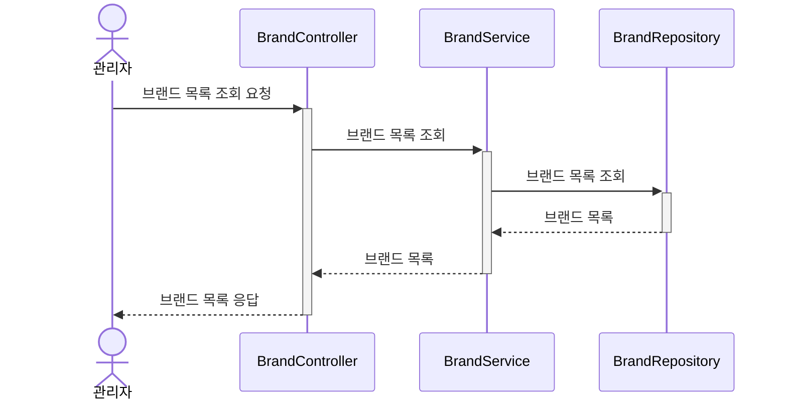
```mermaid
sequenceDiagram
    actor Admin as 관리자
    participant BC as BrandController
    participant BS as BrandService
    participant BR as BrandRepository

    Admin->>+BC: 브랜드 목록 조회 요청
    BC->>+BS: 브랜드 목록 조회
    BS->>+BR: 브랜드 목록 조회
    BR-->>-BS: 브랜드 목록
    BS-->>-BC: 브랜드 목록
    BC-->>-Admin: 브랜드 목록 응답
```

---

### 브랜드 상세 조회 (관리자)

관리자는 특정 브랜드의 상세 정보를 조회할 수 있다.

```mermaid
sequenceDiagram
    actor Admin as 관리자
    participant BC as BrandController
    participant BS as BrandService
    participant BR as BrandRepository

    Admin->>+BC: 브랜드 상세 조회 요청 (brandId)
    BC->>+BS: 브랜드 상세 조회(brandId)
    BS->>+BR: 브랜드 조회
    BR-->>-BS: 브랜드 정보

    opt 브랜드 미존재
        BS-->>BC: 예외
        BC-->>Admin: 404 Not Found
    end

    BS-->>-BC: 브랜드 상세 정보
    BC-->>-Admin: 브랜드 상세 응답
```

---

### 브랜드 수정 (관리자)

관리자는 브랜드 정보를 수정할 수 있다.

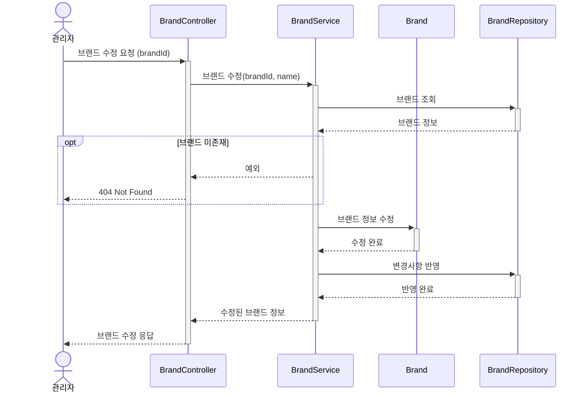
```mermaid
sequenceDiagram
    actor Admin as 관리자
    participant BC as BrandController
    participant BS as BrandService
    participant B as Brand
    participant BR as BrandRepository

    Admin->>+BC: 브랜드 수정 요청 (brandId)
    BC->>+BS: 브랜드 수정(brandId, name)
    BS->>+BR: 브랜드 조회
    BR-->>-BS: 브랜드 정보

    opt 브랜드 미존재
        BS-->>BC: 예외
        BC-->>Admin: 404 Not Found
    end

    BS->>+B: 브랜드 정보 수정
    B-->>-BS: 수정 완료
    BS->>+BR: 변경사항 반영
    BR-->>-BS: 반영 완료
    BS-->>-BC: 수정된 브랜드 정보
    BC-->>-Admin: 브랜드 수정 응답
```

---

### 브랜드 삭제 (관리자)

관리자는 브랜드를 삭제할 수 있다. 브랜드 삭제 시 해당 브랜드에 속한 상품의 좋아요와 상품도 함께 삭제된다.

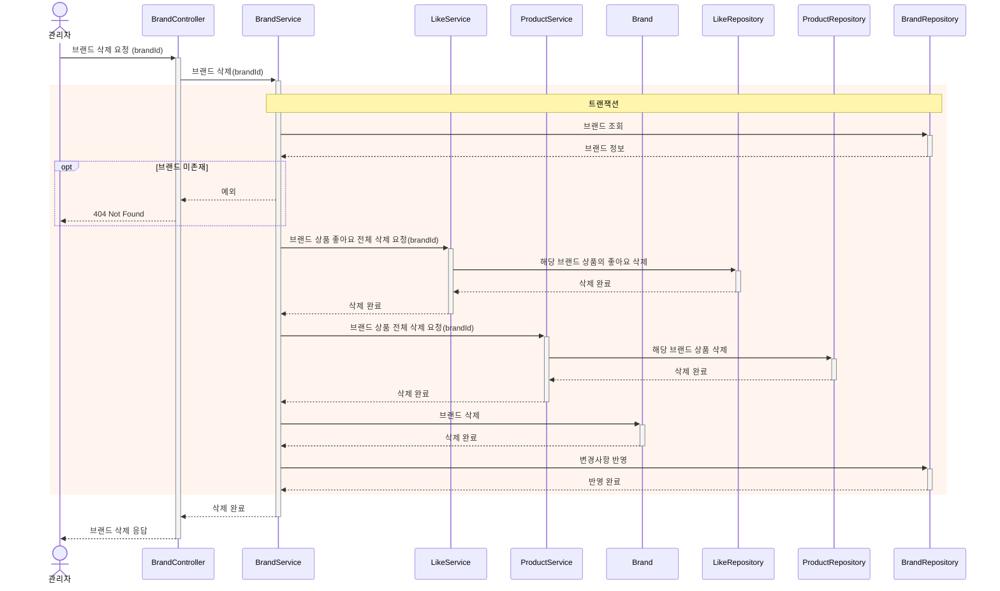
```mermaid
sequenceDiagram
    actor Admin as 관리자
    participant BC as BrandController
    participant BS as BrandService
    participant LS as LikeService
    participant PS as ProductService
    participant B as Brand
    participant LR as LikeRepository
    participant PR as ProductRepository
    participant BR as BrandRepository

    Admin->>+BC: 브랜드 삭제 요청 (brandId)
    BC->>+BS: 브랜드 삭제(brandId)

    rect rgb(255, 245, 238)
        Note over BS, BR: 트랜잭션
        BS->>+BR: 브랜드 조회
        BR-->>-BS: 브랜드 정보

        opt 브랜드 미존재
            BS-->>BC: 예외
            BC-->>Admin: 404 Not Found
        end

        BS->>+LS: 브랜드 상품 좋아요 전체 삭제 요청(brandId)
        LS->>+LR: 해당 브랜드 상품의 좋아요 삭제
        LR-->>-LS: 삭제 완료
        LS-->>-BS: 삭제 완료

        BS->>+PS: 브랜드 상품 전체 삭제 요청(brandId)
        PS->>+PR: 해당 브랜드 상품 삭제
        PR-->>-PS: 삭제 완료
        PS-->>-BS: 삭제 완료

        BS->>+B: 브랜드 삭제
        B-->>-BS: 삭제 완료
        BS->>+BR: 변경사항 반영
        BR-->>-BS: 반영 완료
    end

    BS-->>-BC: 삭제 완료
    BC-->>-Admin: 브랜드 삭제 응답
```

**해석**:
- 브랜드 삭제는 좋아요(하드 삭제) → 상품(소프트 삭제) → 브랜드(소프트 삭제) 순서로 캐스케이드 삭제된다.
- 하나의 트랜잭션 안에서 처리되어 일관성을 보장한다.

---

## 상품

### 상품 목록 조회 (사용자)

사용자는 상품 목록을 조회할 수 있다. 상품 정보에는 브랜드 정보와 좋아요 수가 포함된다.

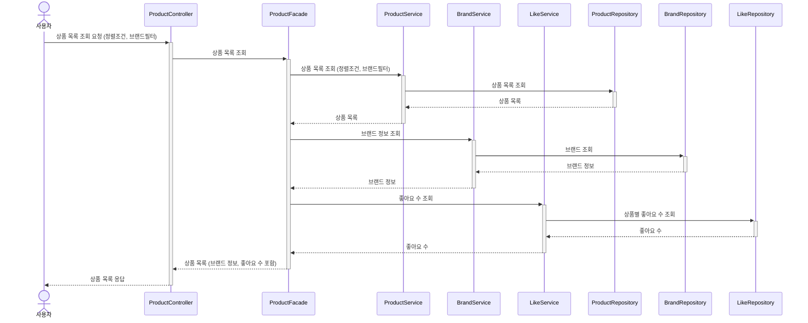
```mermaid
sequenceDiagram
    actor User as 사용자
    participant PC as ProductController
    participant PF as ProductFacade
    participant PS as ProductService
    participant BS as BrandService
    participant LS as LikeService
    participant PR as ProductRepository
    participant BR as BrandRepository
    participant LR as LikeRepository

    User->>+PC: 상품 목록 조회 요청 (정렬조건, 브랜드필터)
    PC->>+PF: 상품 목록 조회

    PF->>+PS: 상품 목록 조회 (정렬조건, 브랜드필터)
    PS->>+PR: 상품 목록 조회
    PR-->>-PS: 상품 목록
    PS-->>-PF: 상품 목록

    PF->>+BS: 브랜드 정보 조회
    BS->>+BR: 브랜드 조회
    BR-->>-BS: 브랜드 정보
    BS-->>-PF: 브랜드 정보

    PF->>+LS: 좋아요 수 조회
    LS->>+LR: 상품별 좋아요 수 조회
    LR-->>-LS: 좋아요 수
    LS-->>-PF: 좋아요 수

    PF-->>-PC: 상품 목록 (브랜드 정보, 좋아요 수 포함)
    PC-->>-User: 상품 목록 응답
```

**해석**:
- 상품 조회에 브랜드 정보와 좋아요 수가 포함되므로, 여러 도메인이 엮여 `ProductFacade`가 조합을 담당한다.
- 정렬 조건(최신순, 가격순, 좋아요순)과 브랜드 필터링을 지원한다.

---

### 상품 상세 조회 (사용자)

사용자는 특정 상품의 상세 정보를 조회할 수 있다. 상품 정보에는 브랜드 정보와 좋아요 수가 포함된다.

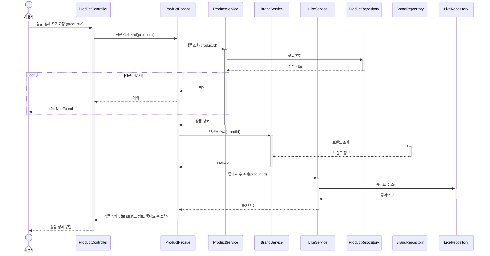
```mermaid
sequenceDiagram
    actor User as 사용자
    participant PC as ProductController
    participant PF as ProductFacade
    participant PS as ProductService
    participant BS as BrandService
    participant LS as LikeService
    participant PR as ProductRepository
    participant BR as BrandRepository
    participant LR as LikeRepository

    User->>+PC: 상품 상세 조회 요청 (productId)
    PC->>+PF: 상품 상세 조회(productId)

    PF->>+PS: 상품 조회(productId)
    PS->>+PR: 상품 조회
    PR-->>-PS: 상품 정보

    opt 상품 미존재
        PS-->>PF: 예외
        PF-->>PC: 예외
        PC-->>User: 404 Not Found
    end

    PS-->>-PF: 상품 정보

    PF->>+BS: 브랜드 조회(brandId)
    BS->>+BR: 브랜드 조회
    BR-->>-BS: 브랜드 정보
    BS-->>-PF: 브랜드 정보

    PF->>+LS: 좋아요 수 조회(productId)
    LS->>+LR: 좋아요 수 조회
    LR-->>-LS: 좋아요 수
    LS-->>-PF: 좋아요 수

    PF-->>-PC: 상품 상세 정보 (브랜드 정보, 좋아요 수 포함)
    PC-->>-User: 상품 상세 응답
```

**해석**:
- 상품 상세 조회 시 Product + Brand + Like 세 도메인의 정보를 조합하므로 `ProductFacade`가 담당한다.
- Controller는 단일 도메인이 아닌 복합 조회이므로 Facade를 호출한다.

---

### 상품 등록 (관리자)

관리자는 새로운 상품을 등록할 수 있다. 상품이 속할 브랜드가 사전에 등록되어 있어야 한다.

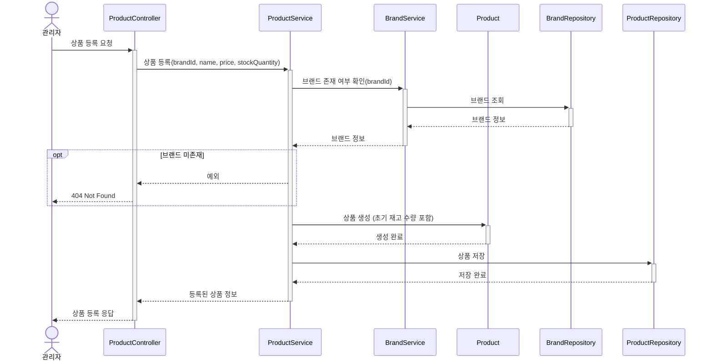
```mermaid
sequenceDiagram
    actor Admin as 관리자
    participant PC as ProductController
    participant PS as ProductService
    participant BS as BrandService
    participant P as Product
    participant BR as BrandRepository
    participant PR as ProductRepository

    Admin->>+PC: 상품 등록 요청
    PC->>+PS: 상품 등록(brandId, name, price, stockQuantity)
    PS->>+BS: 브랜드 존재 여부 확인(brandId)
    BS->>+BR: 브랜드 조회
    BR-->>-BS: 브랜드 정보
    BS-->>-PS: 브랜드 정보

    opt 브랜드 미존재
        PS-->>PC: 예외
        PC-->>Admin: 404 Not Found
    end

    PS->>+P: 상품 생성 (초기 재고 수량 포함)
    P-->>-PS: 생성 완료
    PS->>+PR: 상품 저장
    PR-->>-PS: 저장 완료
    PS-->>-PC: 등록된 상품 정보
    PC-->>-Admin: 상품 등록 응답
```

---

### 상품 목록 조회 (관리자)

관리자는 등록된 상품 목록을 조회할 수 있다.

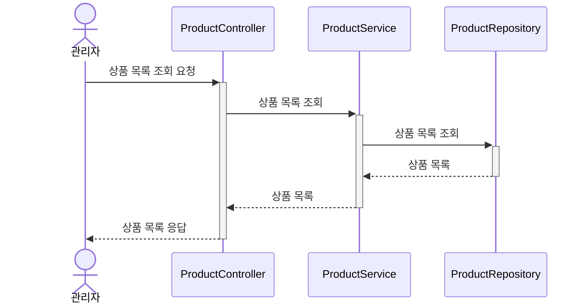
```mermaid
sequenceDiagram
    actor Admin as 관리자
    participant PC as ProductController
    participant PS as ProductService
    participant PR as ProductRepository

    Admin->>+PC: 상품 목록 조회 요청
    PC->>+PS: 상품 목록 조회
    PS->>+PR: 상품 목록 조회
    PR-->>-PS: 상품 목록
    PS-->>-PC: 상품 목록
    PC-->>-Admin: 상품 목록 응답
```

---

### 상품 상세 조회 (관리자)

관리자는 특정 상품의 상세 정보를 조회할 수 있다.

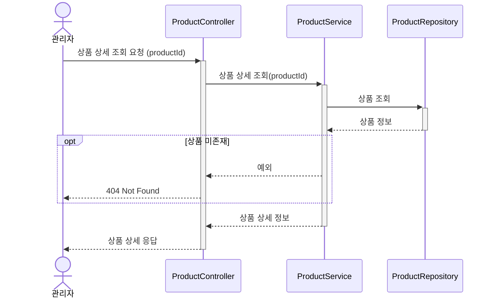
```mermaid
sequenceDiagram
    actor Admin as 관리자
    participant PC as ProductController
    participant PS as ProductService
    participant PR as ProductRepository

    Admin->>+PC: 상품 상세 조회 요청 (productId)
    PC->>+PS: 상품 상세 조회(productId)
    PS->>+PR: 상품 조회
    PR-->>-PS: 상품 정보

    opt 상품 미존재
        PS-->>PC: 예외
        PC-->>Admin: 404 Not Found
    end

    PS-->>-PC: 상품 상세 정보
    PC-->>-Admin: 상품 상세 응답
```

---

### 상품 수정 (관리자)

관리자는 상품 정보를 수정할 수 있다. 재고 수량도 수정 가능하다.

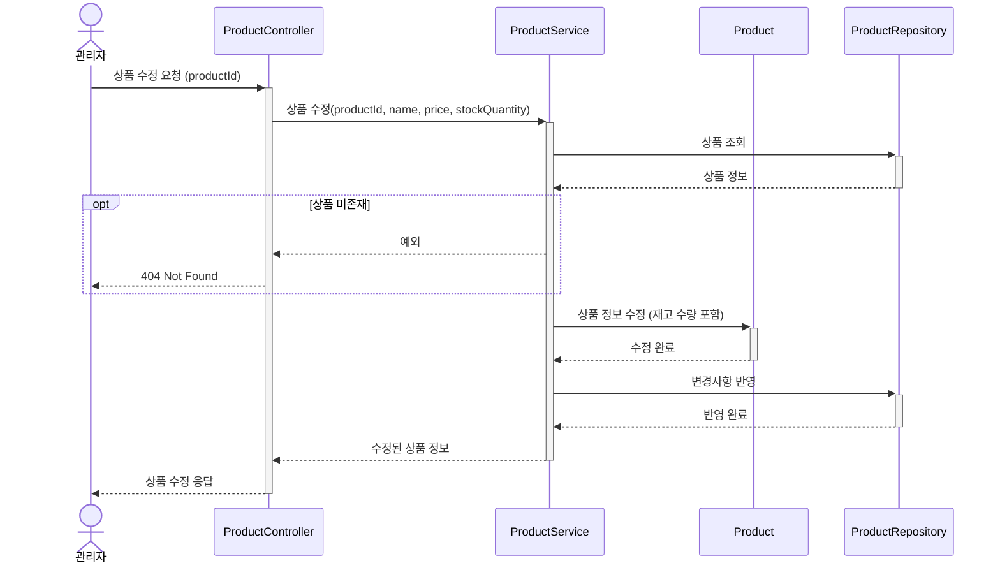
```mermaid
sequenceDiagram
    actor Admin as 관리자
    participant PC as ProductController
    participant PS as ProductService
    participant P as Product
    participant PR as ProductRepository

    Admin->>+PC: 상품 수정 요청 (productId)
    PC->>+PS: 상품 수정(productId, name, price, stockQuantity)
    PS->>+PR: 상품 조회
    PR-->>-PS: 상품 정보

    opt 상품 미존재
        PS-->>PC: 예외
        PC-->>Admin: 404 Not Found
    end

    PS->>+P: 상품 정보 수정 (재고 수량 포함)
    P-->>-PS: 수정 완료
    PS->>+PR: 변경사항 반영
    PR-->>-PS: 반영 완료
    PS-->>-PC: 수정된 상품 정보
    PC-->>-Admin: 상품 수정 응답
```

---

### 상품 삭제 (관리자)

관리자는 상품을 삭제할 수 있다. 상품 삭제 시 해당 상품의 좋아요도 함께 삭제된다.

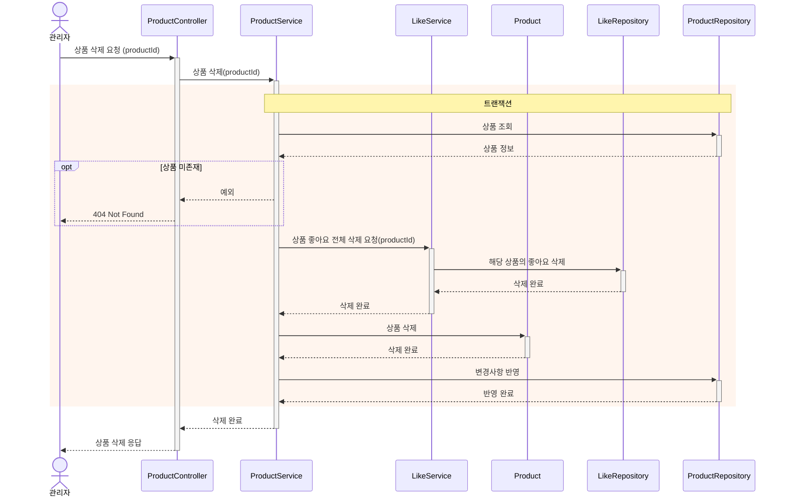
```mermaid
sequenceDiagram
    actor Admin as 관리자
    participant PC as ProductController
    participant PS as ProductService
    participant LS as LikeService
    participant P as Product
    participant LR as LikeRepository
    participant PR as ProductRepository

    Admin->>+PC: 상품 삭제 요청 (productId)
    PC->>+PS: 상품 삭제(productId)

    rect rgb(255, 245, 238)
        Note over PS, PR: 트랜잭션
        PS->>+PR: 상품 조회
        PR-->>-PS: 상품 정보

        opt 상품 미존재
            PS-->>PC: 예외
            PC-->>Admin: 404 Not Found
        end

        PS->>+LS: 상품 좋아요 전체 삭제 요청(productId)
        LS->>+LR: 해당 상품의 좋아요 삭제
        LR-->>-LS: 삭제 완료
        LS-->>-PS: 삭제 완료

        PS->>+P: 상품 삭제
        P-->>-PS: 삭제 완료
        PS->>+PR: 변경사항 반영
        PR-->>-PS: 반영 완료
    end

    PS-->>-PC: 삭제 완료
    PC-->>-Admin: 상품 삭제 응답
```

**해석**:
- 상품 삭제는 좋아요(하드 삭제) → 상품(소프트 삭제) 순서로 캐스케이드 삭제된다.
- 하나의 트랜잭션 안에서 처리되어 일관성을 보장한다.

---

## 좋아요

### 좋아요 등록

사용자는 특정 상품에 좋아요를 할 수 있다.

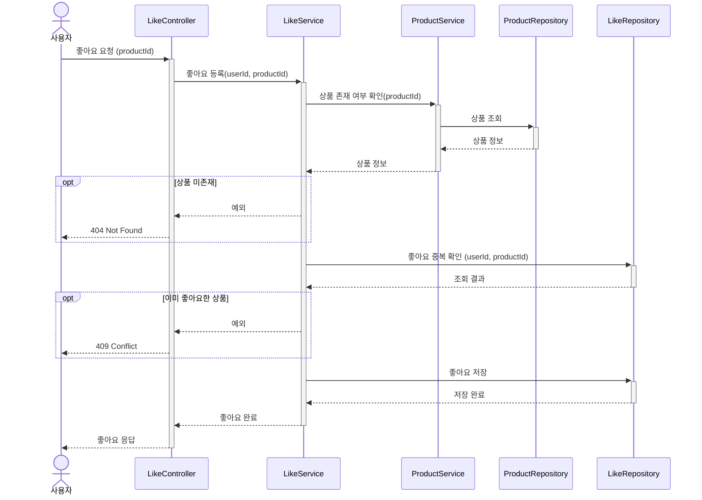
```mermaid
sequenceDiagram
    actor User as 사용자
    participant LC as LikeController
    participant LS as LikeService
    participant PS as ProductService
    participant PR as ProductRepository
    participant LR as LikeRepository

    User->>+LC: 좋아요 요청 (productId)
    LC->>+LS: 좋아요 등록(userId, productId)
    LS->>+PS: 상품 존재 여부 확인(productId)
    PS->>+PR: 상품 조회
    PR-->>-PS: 상품 정보
    PS-->>-LS: 상품 정보

    opt 상품 미존재
        LS-->>LC: 예외
        LC-->>User: 404 Not Found
    end

    LS->>+LR: 좋아요 중복 확인 (userId, productId)
    LR-->>-LS: 조회 결과

    opt 이미 좋아요한 상품
        LS-->>LC: 예외
        LC-->>User: 409 Conflict
    end

    LS->>+LR: 좋아요 저장
    LR-->>-LS: 저장 완료
    LS-->>-LC: 좋아요 완료
    LC-->>-User: 좋아요 응답
```

**해석**:
- 동일 상품에 대한 중복 좋아요는 허용되지 않는다.
- 좋아요 수는 별도 필드에 저장하지 않고, 조회 시 `product_likes` 테이블에서 COUNT 집계로 계산한다.

---

### 좋아요 취소

사용자는 자신이 좋아요한 상품의 좋아요를 취소할 수 있다.

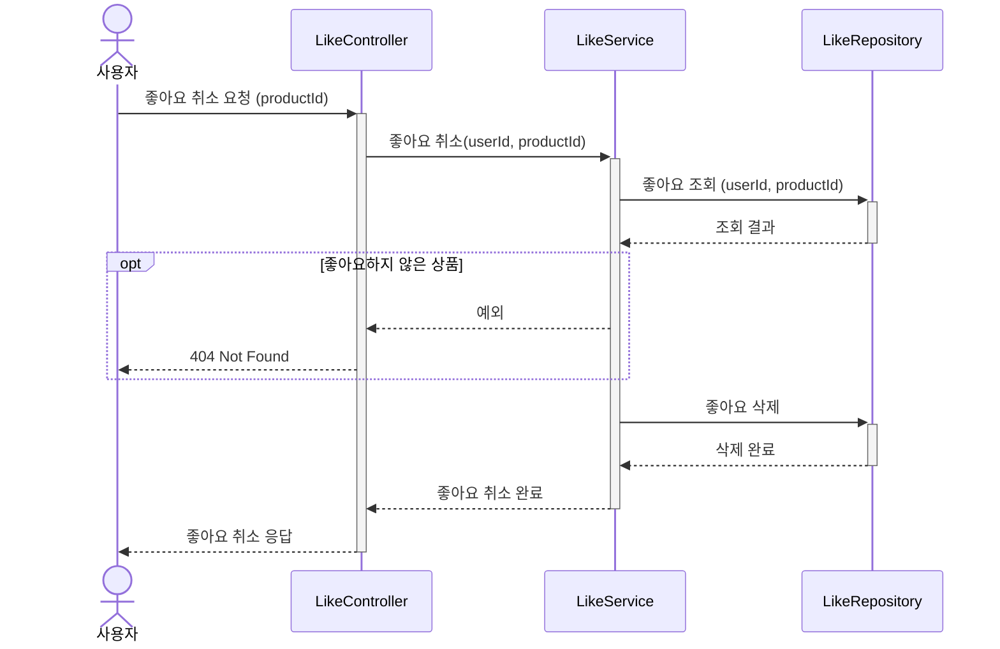
```mermaid
sequenceDiagram
    actor User as 사용자
    participant LC as LikeController
    participant LS as LikeService
    participant LR as LikeRepository

    User->>+LC: 좋아요 취소 요청 (productId)
    LC->>+LS: 좋아요 취소(userId, productId)
    LS->>+LR: 좋아요 조회 (userId, productId)
    LR-->>-LS: 조회 결과

    opt 좋아요하지 않은 상품
        LS-->>LC: 예외
        LC-->>User: 404 Not Found
    end

    LS->>+LR: 좋아요 삭제
    LR-->>-LS: 삭제 완료
    LS-->>-LC: 좋아요 취소 완료
    LC-->>-User: 좋아요 취소 응답
```

**해석**:
- 좋아요하지 않은 상품에 대한 취소 요청은 예외 처리된다.
- 좋아요 삭제는 하드 삭제(DELETE)로 처리된다.

---

### 좋아요한 상품 목록 조회

사용자는 자신이 좋아요한 상품 목록을 조회할 수 있다.

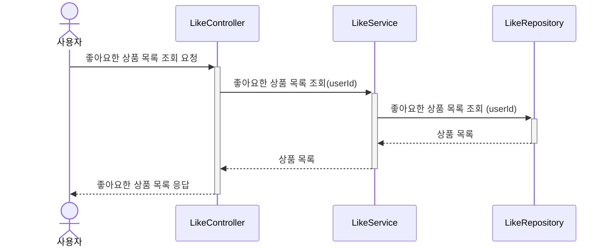
```mermaid
sequenceDiagram
    actor User as 사용자
    participant LC as LikeController
    participant LS as LikeService
    participant LR as LikeRepository

    User->>+LC: 좋아요한 상품 목록 조회 요청
    LC->>+LS: 좋아요한 상품 목록 조회(userId)
    LS->>+LR: 좋아요한 상품 목록 조회 (userId)
    LR-->>-LS: 상품 목록
    LS-->>-LC: 상품 목록
    LC-->>-User: 좋아요한 상품 목록 응답
```

---

## 주문

### 주문 생성

사용자는 여러 상품을 한 번에 주문할 수 있다. 사용자 쿠폰을 선택적으로 적용할 수 있으며, 단일 트랜잭션에서 재고 검증, 재고 차감, 쿠폰 검증, 주문 생성을 처리한다.

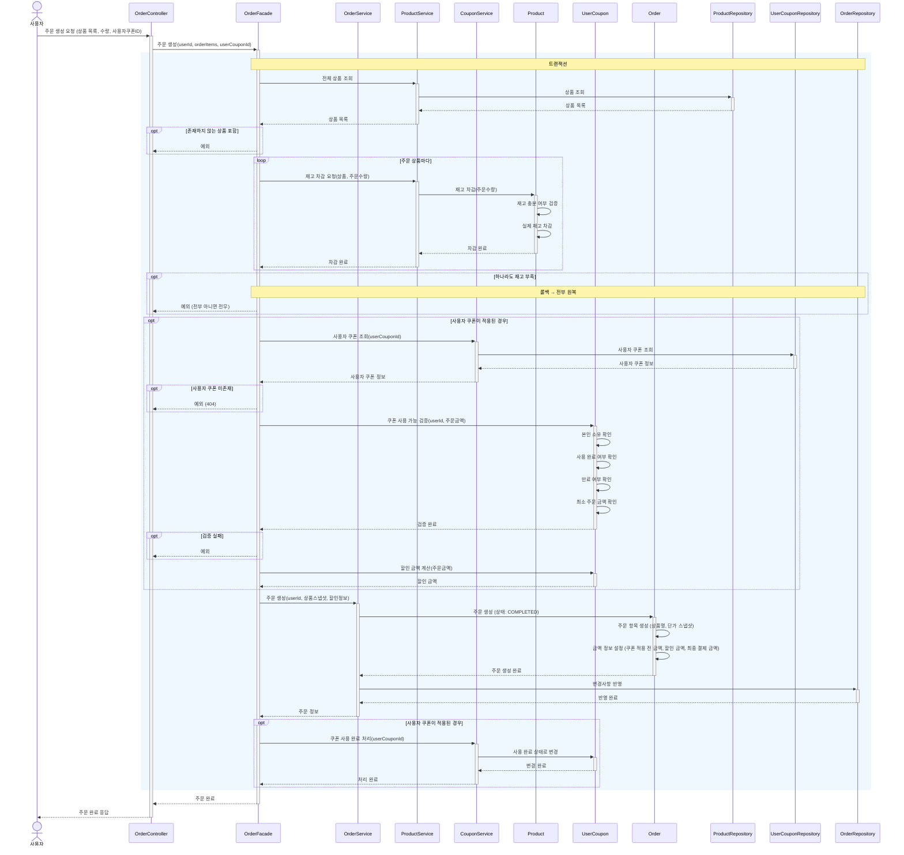
```mermaid
sequenceDiagram
    actor User as 사용자
    participant OC as OrderController
    participant OF as OrderFacade
    participant OS as OrderService
    participant PS as ProductService
    participant CS as CouponService
    participant P as Product
    participant UC as UserCoupon
    participant O as Order
    participant PR as ProductRepository
    participant UCR as UserCouponRepository
    participant OR as OrderRepository

    User->>+OC: 주문 생성 요청 (상품 목록, 수량, 사용자쿠폰ID)
    OC->>+OF: 주문 생성(userId, orderItems, userCouponId)

    rect rgb(240, 248, 255)
        Note over OF, OR: 트랜잭션
        OF->>+PS: 전체 상품 조회
        PS->>+PR: 상품 조회
        PR-->>-PS: 상품 목록
        PS-->>-OF: 상품 목록

        opt 존재하지 않는 상품 포함
            OF-->>OC: 예외
        end

        loop 주문 상품마다
            OF->>+PS: 재고 차감 요청(상품, 주문수량)
            PS->>+P: 재고 차감(주문수량)
            P->>P: 재고 충분 여부 검증
            P->>P: 실제 재고 차감
            P-->>-PS: 차감 완료
            PS-->>-OF: 차감 완료
        end

        opt 하나라도 재고 부족
            Note over OF, OR: 롤백 → 전부 원복
            OF-->>OC: 예외 (전부 아니면 전무)
        end

        opt 사용자 쿠폰이 적용된 경우
            OF->>+CS: 사용자 쿠폰 조회(userCouponId)
            CS->>+UCR: 사용자 쿠폰 조회
            UCR-->>-CS: 사용자 쿠폰 정보
            CS-->>-OF: 사용자 쿠폰 정보

            opt 사용자 쿠폰 미존재
                OF-->>OC: 예외 (404)
            end

            OF->>+UC: 쿠폰 사용 가능 검증(userId, 주문금액)
            UC->>UC: 본인 소유 확인
            UC->>UC: 사용 완료 여부 확인
            UC->>UC: 만료 여부 확인
            UC->>UC: 최소 주문 금액 확인
            UC-->>-OF: 검증 완료

            opt 검증 실패
                OF-->>OC: 예외
            end

            OF->>+UC: 할인 금액 계산(주문금액)
            UC-->>-OF: 할인 금액
        end

        OF->>+OS: 주문 생성(userId, 상품스냅샷, 할인정보)
        OS->>+O: 주문 생성 (상태: COMPLETED)
        O->>O: 주문 항목 생성 (상품명, 단가 스냅샷)
        O->>O: 금액 정보 설정 (쿠폰 적용 전 금액, 할인 금액, 최종 결제 금액)
        O-->>-OS: 주문 생성 완료
        OS->>+OR: 변경사항 반영
        OR-->>-OS: 반영 완료
        OS-->>-OF: 주문 정보

        opt 사용자 쿠폰이 적용된 경우
            OF->>+CS: 쿠폰 사용 완료 처리(userCouponId)
            CS->>+UC: 사용 완료 상태로 변경
            UC-->>-CS: 변경 완료
            CS-->>-OF: 처리 완료
        end
    end

    OF-->>-OC: 주문 완료
    OC-->>-User: 주문 완료 응답
```

**해석**:
- 쿠폰이 적용되는 경우 여러 도메인(Order, Product, Coupon)이 엮이므로 `OrderFacade`가 흐름을 조합한다.
- 단일 트랜잭션에서 재고 검증 → 재고 차감 → 쿠폰 검증 → 주문 생성(COMPLETED) → 쿠폰 사용 완료 처리를 수행한다. 실패 시 전부 롤백된다.
- `CouponService`가 사용자 쿠폰 조회와 사용 완료 처리를 담당한다. `UserCoupon`이 본인 소유 확인, 사용 가능 상태 검증, 최소 주문 금액 검증, 할인 금액 계산을 담당한다.
- `Product`가 재고 충분 여부 검증과 재고 차감을 담당한다. 재고 관련 비즈니스 로직이 도메인 객체에 있다.
- `Order` 생성 시 `OrderItem`에 상품 스냅샷(상품명, 단가)을 보관한다. 이후 상품 정보가 변경되어도 주문 이력은 유지된다.
- 주문 정보에는 쿠폰 적용 전 금액, 할인 금액, 최종 결제 금액이 포함된다. 정액 할인이 주문 금액을 초과하면 최종 결제 금액은 0원이다.

---

### 주문 취소

주문 취소 시 재고를 복원하고, 적용된 사용자 쿠폰이 있으면 사용 가능 상태로 복원한다.

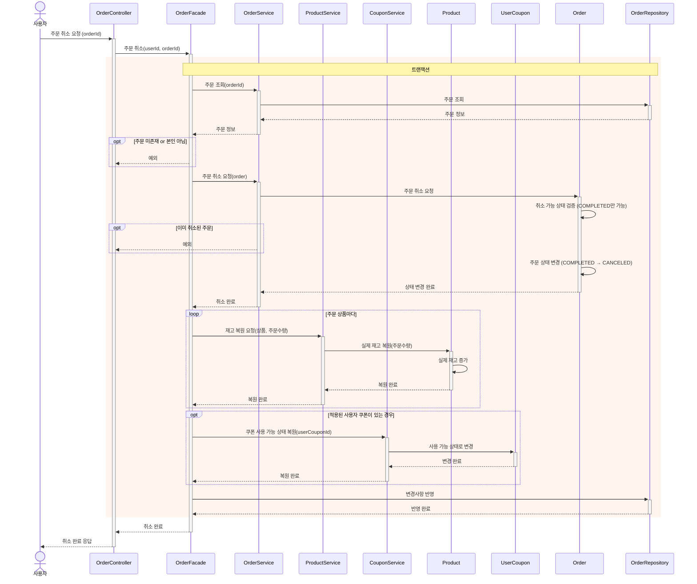
```mermaid
sequenceDiagram
    actor User as 사용자
    participant OC as OrderController
    participant OF as OrderFacade
    participant OS as OrderService
    participant PS as ProductService
    participant CS as CouponService
    participant P as Product
    participant UC as UserCoupon
    participant O as Order
    participant OR as OrderRepository

    User->>+OC: 주문 취소 요청 (orderId)
    OC->>+OF: 주문 취소(userId, orderId)

    rect rgb(255, 245, 238)
        Note over OF, OR: 트랜잭션
        OF->>+OS: 주문 조회(orderId)
        OS->>+OR: 주문 조회
        OR-->>-OS: 주문 정보
        OS-->>-OF: 주문 정보

        opt 주문 미존재 or 본인 아님
            OF-->>OC: 예외
        end

        OF->>+OS: 주문 취소 요청(order)
        OS->>+O: 주문 취소 요청
        O->>O: 취소 가능 상태 검증 (COMPLETED만 가능)

        opt 이미 취소된 주문
            OS-->>OC: 예외
        end

        O->>O: 주문 상태 변경 (COMPLETED → CANCELED)
        O-->>-OS: 상태 변경 완료
        OS-->>-OF: 취소 완료

        loop 주문 상품마다
            OF->>+PS: 재고 복원 요청(상품, 주문수량)
            PS->>+P: 실제 재고 복원(주문수량)
            P->>P: 실제 재고 증가
            P-->>-PS: 복원 완료
            PS-->>-OF: 복원 완료
        end

        opt 적용된 사용자 쿠폰이 있는 경우
            OF->>+CS: 쿠폰 사용 가능 상태 복원(userCouponId)
            CS->>+UC: 사용 가능 상태로 변경
            UC-->>-CS: 변경 완료
            CS-->>-OF: 복원 완료
        end

        OF->>+OR: 변경사항 반영
        OR-->>-OF: 반영 완료
    end

    OF-->>-OC: 취소 완료
    OC-->>-User: 취소 완료 응답
```

**해석**:
- 주문 취소 시 여러 도메인(Order, Product, Coupon)이 엮이므로 `OrderFacade`가 흐름을 조합한다.
- 단일 트랜잭션에서 주문 상태 변경 → 재고 복원 → 쿠폰 상태 복원을 처리한다.
- 적용된 사용자 쿠폰이 있는 경우에만 쿠폰 상태를 사용 가능으로 복원한다.

---

### 주문 목록 조회 (사용자)

사용자는 본인의 주문 내역을 조회할 수 있다.

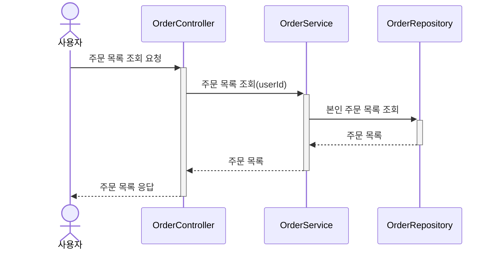
```mermaid
sequenceDiagram
    actor User as 사용자
    participant OC as OrderController
    participant OS as OrderService
    participant OR as OrderRepository

    User->>+OC: 주문 목록 조회 요청
    OC->>+OS: 주문 목록 조회(userId)
    OS->>+OR: 본인 주문 목록 조회
    OR-->>-OS: 주문 목록
    OS-->>-OC: 주문 목록
    OC-->>-User: 주문 목록 응답
```

**해석**:
- 본인의 주문만 조회 가능하다.

---

### 주문 상세 조회 (사용자)

사용자는 본인의 특정 주문 상세 정보를 조회할 수 있다.

```mermaid
sequenceDiagram
    actor User as 사용자
    participant OC as OrderController
    participant OS as OrderService
    participant OR as OrderRepository

    User->>+OC: 주문 상세 조회 요청 (orderId)
    OC->>+OS: 주문 상세 조회(userId, orderId)
    OS->>+OR: 주문 조회 (주문 항목 포함)
    OR-->>-OS: 주문 정보

    opt 주문 미존재
        OS-->>OC: 예외
        OC-->>User: 404 Not Found
    end

    opt 본인 주문 아님
        OS-->>OC: 예외
        OC-->>User: 403 Forbidden
    end

    OS-->>-OC: 주문 상세 정보 (주문 상품 스냅샷 포함)
    OC-->>-User: 주문 상세 응답
```

**해석**:
- 본인의 주문만 조회 가능하다. 타 사용자의 주문 접근 시 예외 처리된다.
- 주문 상세에는 OrderItem의 스냅샷(상품명, 단가)이 포함된다.

---

### 주문 목록 조회 (관리자)

관리자는 전체 사용자의 주문 목록을 조회할 수 있다.

```mermaid
sequenceDiagram
    actor Admin as 관리자
    participant OC as OrderController
    participant OS as OrderService
    participant OR as OrderRepository

    Admin->>+OC: 주문 목록 조회 요청
    OC->>+OS: 전체 주문 목록 조회
    OS->>+OR: 전체 주문 목록 조회
    OR-->>-OS: 주문 목록
    OS-->>-OC: 주문 목록
    OC-->>-Admin: 주문 목록 응답
```

---

### 주문 상세 조회 (관리자)

관리자는 특정 주문의 상세 정보를 조회할 수 있다.

```mermaid
sequenceDiagram
    actor Admin as 관리자
    participant OC as OrderController
    participant OS as OrderService
    participant OR as OrderRepository

    Admin->>+OC: 주문 상세 조회 요청 (orderId)
    OC->>+OS: 주문 상세 조회(orderId)
    OS->>+OR: 주문 조회 (주문 항목 포함)
    OR-->>-OS: 주문 정보

    opt 주문 미존재
        OS-->>OC: 예외
        OC-->>Admin: 404 Not Found
    end

    OS-->>-OC: 주문 상세 정보 (주문 상품 스냅샷 포함)
    OC-->>-Admin: 주문 상세 응답
```

---

## 쿠폰

쿠폰 도메인은 쿠폰(Coupon)과 사용자 쿠폰(UserCoupon) 두 개의 도메인으로 구성된다. UserCoupon은 Coupon의 하위 개념으로, CouponService가 두 도메인을 함께 관리한다.

| 구분 | 담당 도메인 | 의존 대상 |
|------|-----------|----------|
| CouponService | 쿠폰, 사용자 쿠폰 | CouponRepository, UserCouponRepository |

---

### 쿠폰 발급 요청

사용자가 쿠폰 발급을 요청한다. 쿠폰의 삭제 여부, 유효기간, 중복 발급 여부를 검증한 후 사용자 쿠폰을 생성한다.

```mermaid
sequenceDiagram
    actor User as 사용자
    participant CC as CouponController
    participant CS as CouponService
    participant C as Coupon
    participant CR as CouponRepository
    participant UCR as UserCouponRepository

    User->>+CC: 쿠폰 발급 요청 (couponId)
    CC->>+CS: 쿠폰 발급 요청(userId, couponId)

    rect rgb(240, 248, 255)
        Note over CS, UCR: 트랜잭션

        CS->>+CR: 쿠폰 조회
        CR-->>-CS: 쿠폰 정보

        opt 쿠폰 미존재
            CS-->>CC: 예외
            CC-->>User: 404 Not Found
        end

        CS->>+C: 발급 가능 여부 검증
        C->>C: 삭제 여부 확인
        C->>C: 유효기간 확인
        C-->>-CS: 검증 완료

        opt 삭제된 쿠폰 or 유효기간 만료
            CS-->>CC: 예외
        end

        CS->>+UCR: 중복 발급 확인(userId, couponId)
        UCR-->>-CS: 존재 여부

        opt 이미 발급받은 쿠폰
            CS-->>CC: 예외
            CC-->>User: 409 Conflict
        end

        CS->>+C: 사용자 쿠폰 생성(userId)
        C-->>-CS: UserCoupon
        CS->>+UCR: 사용자 쿠폰 저장
        UCR-->>-CS: 저장 완료
    end

    CS-->>-CC: 발급 완료
    CC-->>-User: 쿠폰 발급 응답
```

**해석**:
- CouponService가 쿠폰 조회, 발급 가능 여부 검증, 중복 발급 확인, 사용자 쿠폰 생성을 모두 담당한다.
- Coupon 엔티티가 자기 상태로 발급 가능 여부를 판단하고, `issue(userId)`로 UserCoupon을 생성한다.
- 단일 트랜잭션에서 검증과 생성을 처리하여 데이터 일관성을 보장한다.

---

### 내 쿠폰 목록 조회

사용자는 본인이 발급받은 쿠폰 목록을 조회할 수 있다. 사용 가능, 사용 완료, 만료 상태의 쿠폰을 모두 반환한다.

```mermaid
sequenceDiagram
    actor User as 사용자
    participant CC as CouponController
    participant CS as CouponService
    participant UCR as UserCouponRepository

    User->>+CC: 내 쿠폰 목록 조회 요청
    CC->>+CS: 내 쿠폰 목록 조회(userId)
    CS->>+UCR: 사용자 쿠폰 목록 조회 (userId)
    UCR-->>-CS: 사용자 쿠폰 목록
    CS-->>-CC: 쿠폰 목록
    CC-->>-User: 내 쿠폰 목록 응답
```

---

### 쿠폰 생성 (관리자)

관리자는 새로운 쿠폰을 생성할 수 있다.

```mermaid
sequenceDiagram
    actor Admin as 관리자
    participant CC as CouponController
    participant CS as CouponService
    participant C as Coupon
    participant CR as CouponRepository

    Admin->>+CC: 쿠폰 생성 요청
    CC->>+CS: 쿠폰 생성(name, discountType, discountValue, minOrderAmount, expiredAt)
    CS->>+C: 쿠폰 생성
    C-->>-CS: 생성 완료
    CS->>+CR: 쿠폰 저장
    CR-->>-CS: 저장 완료
    CS-->>-CC: 생성된 쿠폰 정보
    CC-->>-Admin: 쿠폰 생성 응답
```

---

### 쿠폰 목록 조회 (관리자)

관리자는 등록된 쿠폰 목록을 조회할 수 있다.

```mermaid
sequenceDiagram
    actor Admin as 관리자
    participant CC as CouponController
    participant CS as CouponService
    participant CR as CouponRepository

    Admin->>+CC: 쿠폰 목록 조회 요청
    CC->>+CS: 쿠폰 목록 조회
    CS->>+CR: 쿠폰 목록 조회
    CR-->>-CS: 쿠폰 목록
    CS-->>-CC: 쿠폰 목록
    CC-->>-Admin: 쿠폰 목록 응답
```

---

### 쿠폰 상세 조회 (관리자)

관리자는 특정 쿠폰의 상세 정보를 조회할 수 있다.

```mermaid
sequenceDiagram
    actor Admin as 관리자
    participant CC as CouponController
    participant CS as CouponService
    participant CR as CouponRepository

    Admin->>+CC: 쿠폰 상세 조회 요청 (couponId)
    CC->>+CS: 쿠폰 상세 조회(couponId)
    CS->>+CR: 쿠폰 조회
    CR-->>-CS: 쿠폰 정보

    opt 쿠폰 미존재
        CS-->>CC: 예외
        CC-->>Admin: 404 Not Found
    end

    CS-->>-CC: 쿠폰 상세 정보
    CC-->>-Admin: 쿠폰 상세 응답
```

---

### 쿠폰 수정 (관리자)

관리자는 쿠폰 정보를 수정할 수 있다. 발급된 사용자 쿠폰이 있는 경우 수정할 수 없다.

```mermaid
sequenceDiagram
    actor Admin as 관리자
    participant CC as CouponController
    participant CS as CouponService
    participant C as Coupon
    participant CR as CouponRepository
    participant UCR as UserCouponRepository

    Admin->>+CC: 쿠폰 수정 요청 (couponId)
    CC->>+CS: 쿠폰 수정(couponId, command)

    rect rgb(255, 245, 238)
        Note over CS, UCR: 트랜잭션

        CS->>+CR: 쿠폰 조회
        CR-->>-CS: 쿠폰 정보

        opt 쿠폰 미존재
            CS-->>CC: 예외
            CC-->>Admin: 404 Not Found
        end

        CS->>+UCR: 발급된 사용자 쿠폰 존재 여부 확인(couponId)
        UCR-->>-CS: 존재 여부

        opt 발급된 사용자 쿠폰 존재
            CS-->>CC: 예외
        end

        CS->>+C: 쿠폰 정보 수정
        C-->>-CS: 수정 완료
        CS->>+CR: 변경사항 반영
        CR-->>-CS: 반영 완료
    end

    CS-->>-CC: 수정된 쿠폰 정보
    CC-->>-Admin: 쿠폰 수정 응답
```

**해석**:
- CouponService가 쿠폰 조회, 발급 여부 확인, 수정을 모두 담당한다.
- 발급된 사용자 쿠폰이 존재하면 수정을 차단하여 발급된 쿠폰의 일관성을 보장한다 (CPN-07).
- 트랜잭션 내에서 조회와 수정을 처리하여 동시성 이슈를 방지한다.

---

### 쿠폰 삭제 (관리자)

관리자는 쿠폰을 삭제할 수 있다. 쿠폰이 삭제되어도 이미 발급된 사용자 쿠폰에는 영향을 주지 않는다.

```mermaid
sequenceDiagram
    actor Admin as 관리자
    participant CC as CouponController
    participant CS as CouponService
    participant C as Coupon
    participant CR as CouponRepository

    Admin->>+CC: 쿠폰 삭제 요청 (couponId)
    CC->>+CS: 쿠폰 삭제(couponId)
    CS->>+CR: 쿠폰 조회
    CR-->>-CS: 쿠폰 정보

    opt 쿠폰 미존재
        CS-->>CC: 예외
        CC-->>Admin: 404 Not Found
    end

    CS->>+C: 쿠폰 삭제
    C-->>-CS: 삭제 완료
    CS->>+CR: 변경사항 반영
    CR-->>-CS: 반영 완료
    CS-->>-CC: 삭제 완료
    CC-->>-Admin: 쿠폰 삭제 응답
```

---

### 쿠폰 발급 내역 조회 (관리자)

관리자는 특정 쿠폰의 발급 내역(사용자 쿠폰)을 조회할 수 있다.

```mermaid
sequenceDiagram
    actor Admin as 관리자
    participant CC as CouponController
    participant CS as CouponService
    participant CR as CouponRepository
    participant UCR as UserCouponRepository

    Admin->>+CC: 쿠폰 발급 내역 조회 요청 (couponId)
    CC->>+CS: 쿠폰 발급 내역 조회(couponId)

    CS->>+CR: 쿠폰 조회
    CR-->>-CS: 쿠폰 정보

    opt 쿠폰 미존재
        CS-->>CC: 예외
        CC-->>Admin: 404 Not Found
    end

    CS->>+UCR: 해당 쿠폰 발급 내역 조회(couponId)
    UCR-->>-CS: 사용자 쿠폰 목록

    CS-->>-CC: 발급 내역
    CC-->>-Admin: 쿠폰 발급 내역 응답
```

---

## 결제

결제 도메인은 외부 PG(Payment Gateway) 서버와 연동하여 결제를 처리한다. PG 서버 장애에 대비하여 서킷 브레이커(Circuit Breaker)를 적용하며, 결제 결과는 PG 서버의 콜백을 통해 최종 확정된다.

| 구분 | 설명 |
|------|------|
| PaymentFacade | 트랜잭션 분리 오케스트레이션 (PG 호출을 트랜잭션 밖에서 수행) |
| PaymentService | 결제 상태 변경(트랜잭션 단위), 콜백 처리 담당 |
| PaymentGatewayClient | 도메인이 정의한 PG 연동 인터페이스 (DIP) |
| PgPaymentGatewayClient | PaymentGatewayClient 구현체, 서킷 브레이커 적용 |

> **인증 참고**: 콜백 엔드포인트(`POST /api/v1/payments/callback`)는 PG 서버에서 호출하므로 인증 헤더가 불필요하다.

---

### 결제 요청 (정상)

사용자가 결제를 요청하면 PG 서버에 결제를 요청하고, PENDING 상태로 응답을 반환한다.

```mermaid
sequenceDiagram
    actor User as 사용자
    participant PC as PaymentController
    participant PF as PaymentFacade
    participant PS as PaymentService
    participant P as Payment
    participant PR as PaymentRepository
    participant GC as PaymentGatewayClient<br/>(CircuitBreaker)
    participant PG as PG 서버

    User->>+PC: 결제 요청 (orderId, cardType, cardNo, amount)
    PC->>+PF: 결제 요청

    rect rgb(240, 248, 255)
        Note over PS, PR: TX1: Payment 생성
        PF->>+PS: 결제 생성 (PENDING)
        PS->>+P: 결제 생성 (status: PENDING)
        P-->>-PS: 생성 완료
        PS->>+PR: 결제 저장
        PR-->>-PS: 저장 완료
        PS-->>-PF: Payment
    end

    Note over PF, GC: 트랜잭션 밖: PG 호출
    PF->>+GC: PG 결제 요청
    GC->>+PG: POST /api/v1/payments
    PG-->>-GC: { transactionKey, status: PENDING }
    GC-->>-PF: PaymentGatewayResponse

    rect rgb(240, 248, 255)
        Note over PS, PR: TX2: transactionKey 할당
        PF->>+PS: 거래 키 할당
        PS->>+PR: 결제 조회
        PR-->>-PS: 결제 정보
        PS->>+P: 거래 키 할당
        P-->>-PS: 할당 완료
        PS-->>-PF: PaymentResult (PENDING)
    end

    PF-->>-PC: PaymentResult (PENDING)
    PC-->>-User: 결제 요청 응답 (PENDING)
```

**해석**:
- 트랜잭션을 분리하여 PG 호출 동안 DB 커넥션을 점유하지 않는다.
- TX1: Payment를 PENDING 상태로 저장 → 커밋. TX2: PG 응답에 따라 transactionKey 할당 → 커밋.
- PG 연동은 도메인이 정의한 `PaymentGatewayClient` 인터페이스를 통해 이루어진다 (DIP).
- PG 호출 실패 시에도 TX1이 이미 커밋되었으므로 PENDING 상태의 Payment가 DB에 남고, 이후 PG 콜백으로 최종 상태가 확정된다.

---

### 결제 요청 (실패)

PG 서버 오류, 서킷 브레이커 OPEN, 타임아웃 등 다양한 실패 시나리오를 처리한다.

```mermaid
sequenceDiagram
    actor User as 사용자
    participant PC as PaymentController
    participant PF as PaymentFacade
    participant PS as PaymentService
    participant P as Payment
    participant PR as PaymentRepository
    participant GC as PaymentGatewayClient<br/>(CircuitBreaker)
    participant PG as PG 서버

    User->>+PC: 결제 요청 (orderId, cardType, cardNo, amount)
    PC->>+PF: 결제 요청

    rect rgb(240, 248, 255)
        Note over PS, PR: TX1: Payment 생성
        PF->>+PS: 결제 생성 (PENDING)
        PS->>+P: 결제 생성 (status: PENDING)
        P-->>-PS: 생성 완료
        PS->>+PR: 결제 저장
        PR-->>-PS: 저장 완료
        PS-->>-PF: Payment
    end

    Note over PF, GC: 트랜잭션 밖: PG 호출
    PF->>+GC: PG 결제 요청

    alt PG 500 에러 (비정상 응답)
        GC->>+PG: POST /api/v1/payments
        PG-->>-GC: 500 에러
        GC-->>PF: CoreException (PAYMENT_GATEWAY_ERROR)

        rect rgb(255, 245, 238)
            Note over PS, PR: TX2: 결제 승인 실패
            PF->>+PS: 결제 승인 실패
            PS->>+PR: 결제 조회
            PR-->>-PS: 결제 정보
            PS->>P: 결제 승인 실패
            Note over P: status: REJECTED
            PS-->>-PF: PaymentResult
        end

        PF-->>PC: 예외
        PC-->>User: 503 Service Unavailable

    else 서킷 브레이커 OPEN
        GC-->>PF: CoreException (서킷 브레이커 OPEN)

        rect rgb(255, 245, 238)
            Note over PS, PR: TX2: 결제 승인 실패
            PF->>+PS: 결제 승인 실패
            PS->>+PR: 결제 조회
            PR-->>-PS: 결제 정보
            PS->>P: 결제 승인 실패
            Note over P: status: REJECTED
            PS-->>-PF: PaymentResult
        end

        PF-->>PC: 예외
        PC-->>User: 503 Service Unavailable

    else 타임아웃
        GC->>+PG: POST /api/v1/payments
        PG-->>-GC: 응답 없음 (타임아웃)
        GC-->>-PF: CoreException (TIMEOUT)

        rect rgb(255, 245, 238)
            Note over PS, PR: TX2: 타임아웃 결제 중단
            PF->>+PS: 타임아웃 결제 중단
            PS->>+PR: 결제 조회
            PR-->>-PS: 결제 정보
            PS->>P: 타임아웃 결제 중단
            Note over P: status: UNKNOWN
            PS-->>-PF: PaymentResult
        end

        PF-->>PC: 예외
        PC-->>User: 503 Service Unavailable
    end

    deactivate PF
    deactivate PC
```

**해석**:
- 트랜잭션이 분리되어 TX1(Payment 생성)은 PG 호출 전에 커밋된다. PG 호출 실패 시 TX2에서 상태를 변경하고 커밋한다.
- PG 500 에러: `RestClientException` 발생 → TX2에서 결제 승인 실패 → REJECTED 상태로 확정된다.
- 서킷 브레이커 OPEN: `CallNotPermittedException` 발생 → PG 서버에 요청하지 않고 TX2에서 결제 승인 실패 → REJECTED 상태로 확정된다.
- 타임아웃: `ResourceAccessException` 발생 → TX2에서 타임아웃 결제 중단 → UNKNOWN 상태가 된다. PG에서 실제로 결제가 처리되었을 수 있으므로 REJECTED가 아닌 UNKNOWN으로 처리한다.
- 기존 단일 트랜잭션에서는 예외 발생 시 롤백되어 결제 승인 실패/타임아웃 결제 중단 상태가 DB에 반영되지 않는 문제가 있었으나, 트랜잭션 분리로 이 문제가 해결되었다.

---

### PG 콜백 수신

PG 서버가 결제 처리 결과를 콜백으로 전달한다. transactionKey로 결제를 조회하여 최종 상태를 확정한다.

```mermaid
sequenceDiagram
    participant PG as PG 서버
    participant PC as PaymentController
    participant PS as PaymentService
    participant P as Payment
    participant PR as PaymentRepository

    PG->>+PC: POST /callback (transactionKey, status, reason)
    PC->>+PS: 콜백 처리

    rect rgb(240, 248, 255)
        Note over PS, PR: 트랜잭션
        PS->>+PR: transactionKey로 결제 조회
        PR-->>-PS: 결제 정보

        opt 결제 미존재
            PS-->>PC: 예외
            PC-->>PG: 404 Not Found
        end

        alt status == SUCCESS
            PS->>+P: 결제 승인
            Note over P: status: APPROVED
            P-->>-PS: 승인 완료
        else status != SUCCESS
            PS->>+P: 결제 승인 실패
            Note over P: status: REJECTED
            P-->>-PS: 거절 완료
        end
    end

    PS-->>-PC: PaymentResult
    PC-->>-PG: 200 OK
```

**해석**:
- PG 서버에서 콜백으로 결제 결과를 전달하면, transactionKey로 결제를 조회하여 상태를 확정한다.
- SUCCESS → 결제 승인 (PENDING/UNKNOWN → APPROVED), 그 외 → 결제 승인 실패 (PENDING/UNKNOWN → REJECTED).
- 이미 최종 처리된 결제(APPROVED 또는 REJECTED)에 대한 콜백은 결제 승인/결제 승인 실패 시 예외를 던져 멱등성을 보장한다.
- 콜백 엔드포인트는 PG 서버에서 호출하므로 `@LoginUser` 인증이 적용되지 않는다.
