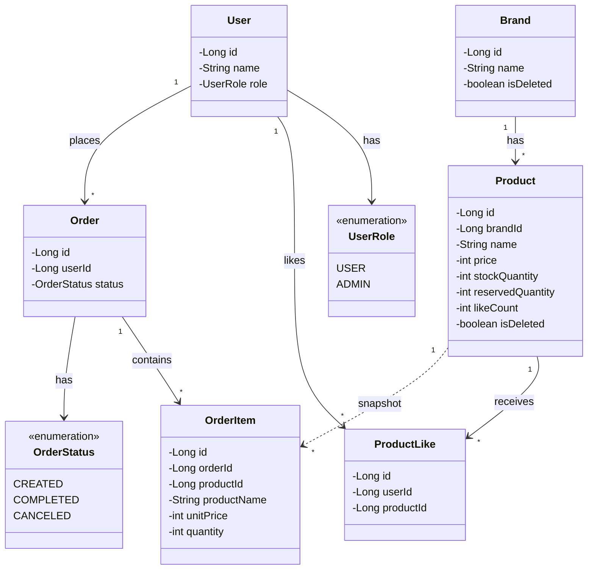

# 클래스 다이어그램

각 도메인의 책임 범위와 의존 방향을 확인하기 위한 다이어그램이다. Order가 Product를 직접 참조하지 않고 스냅샷(OrderItem)으로 분리한 것이 핵심 설계 결정이다.

```mermaid
classDiagram
    class User {
        -Long id
        -String name
        -UserRole role
    }

    class UserRole {
        <<enumeration>>
        USER
        ADMIN
    }

    class Brand {
        -Long id
        -String name
        -boolean isDeleted
    }

    class Product {
        -Long id
        -Long brandId
        -String name
        -int price
        -int stockQuantity
        -int reservedQuantity
        -int likeCount
        -boolean isDeleted
    }

    class ProductLike {
        -Long id
        -Long userId
        -Long productId
    }

    class Order {
        -Long id
        -Long userId
        -OrderStatus status
    }

    class OrderItem {
        -Long id
        -Long orderId
        -Long productId
        -String productName
        -int unitPrice
        -int quantity
    }

    class OrderStatus {
        <<enumeration>>
        CREATED
        COMPLETED
        CANCELED
    }

    User --> UserRole : has
    User "1" --> "*" ProductLike : likes
    User "1" --> "*" Order : places
    Brand "1" --> "*" Product : has
    Product "1" --> "*" ProductLike : receives
    Order "1" --> "*" OrderItem : contains
    Order --> OrderStatus : has
    Product "1" ..> "*" OrderItem : snapshot
```
