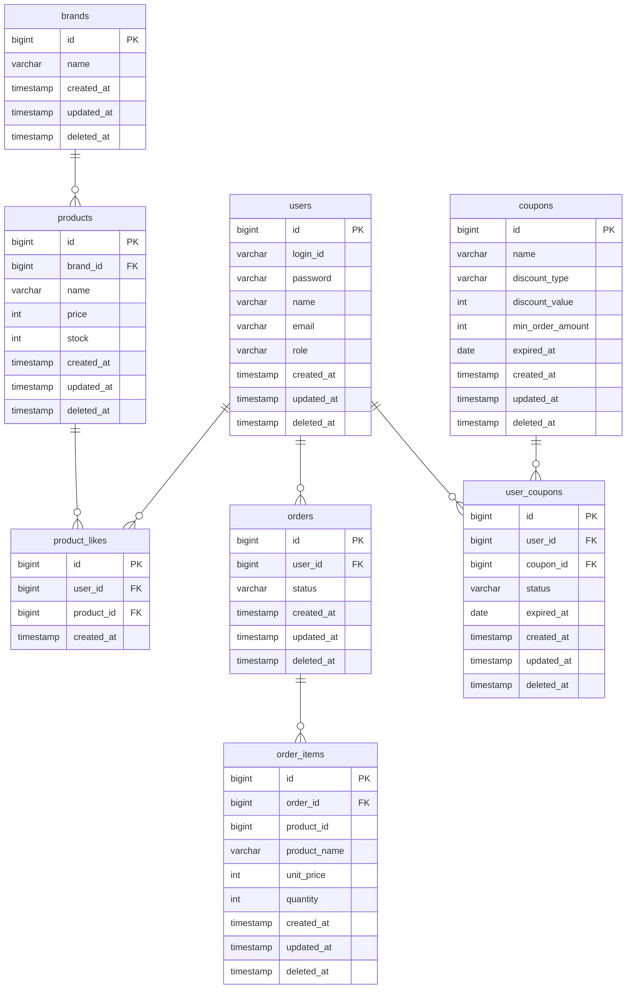

# ERD

실제 테이블 구조와 관계, 제약 조건을 정의한다. 소프트 삭제, 좋아요 유니크 제약, 주문 상품 스냅샷 구조, 쿠폰-사용자 쿠폰 독립 생명주기를 검증하기 위해 작성한다.

```mermaid
erDiagram
    users {
        bigint id PK
        varchar login_id
        varchar password
        varchar name
        varchar email
        varchar role
        timestamp created_at
        timestamp updated_at
        timestamp deleted_at
    }

    brands {
        bigint id PK
        varchar name
        timestamp created_at
        timestamp updated_at
        timestamp deleted_at
    }

    products {
        bigint id PK
        bigint brand_id FK
        varchar name
        int price
        int stock
        timestamp created_at
        timestamp updated_at
        timestamp deleted_at
    }

    product_likes {
        bigint id PK
        bigint user_id FK
        bigint product_id FK
        timestamp created_at
    }

    orders {
        bigint id PK
        bigint user_id FK
        varchar status
        timestamp created_at
        timestamp updated_at
        timestamp deleted_at
    }

    order_items {
        bigint id PK
        bigint order_id FK
        bigint product_id
        varchar product_name
        int unit_price
        int quantity
        timestamp created_at
        timestamp updated_at
        timestamp deleted_at
    }

    coupons {
        bigint id PK
        varchar name
        varchar discount_type
        int discount_value
        int min_order_amount
        date expired_at
        timestamp created_at
        timestamp updated_at
        timestamp deleted_at
    }

    user_coupons {
        bigint id PK
        bigint user_id FK
        bigint coupon_id FK
        varchar status
        date expired_at
        timestamp created_at
        timestamp updated_at
        timestamp deleted_at
    }

    users ||--o{ orders : ""
    users ||--o{ user_coupons : ""
    products ||--o{ product_likes : ""
    users ||--o{ product_likes : ""
    brands ||--o{ products : ""
    orders ||--o{ order_items : ""
    coupons ||--o{ user_coupons : ""
```
